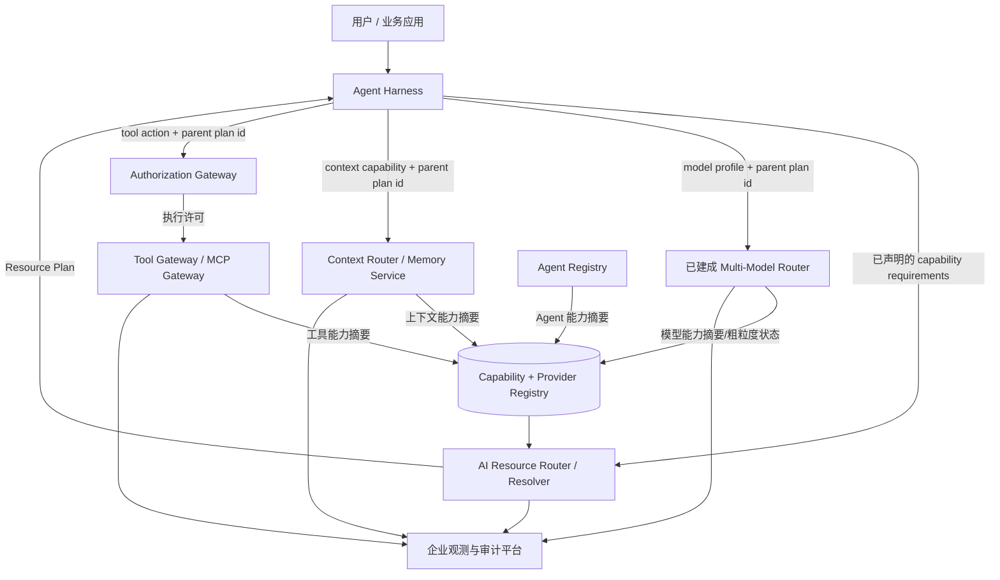

# 制造企业 AI Resource Router 总体架构设计

> 本版完成范围收敛：Multi-Model Router 已建成并作为既有系统复用。AI Resource Router 只负责跨资源域的能力解析与资源计划，不进入模型、上下文或工具的实际调用数据面。

> AI Resource Router 已上拔为 [03 Sovereign AI & Open AI Fabric](../programs/03-sovereign-ai-open-ai-fabric/architecture.md) 的 03.3 子项目。本文保留为 Router 边界与资源能力详细说明；完整 4A、API、数据事件、MMR 对接和实施设计以 [AI Resource Router 子项目 4A 架构](./ai-routing-platform-4a.md) 及其关联文档为准。

## 1. 一句话定位

**AI Resource Router 是“跨资源域的能力解析服务”：把 Agent 已明确声明的能力需求，解析成由哪些既有专业服务负责，并返回带版本、约束和关联 ID 的 Resource Plan。**

它不理解完整业务流程，不选择具体模型，不执行工具，不检索知识，不作授权裁决。更准确的工程名称可以是 **AI Resource Resolver**；保留 Router 名称时，也必须按这个边界实施。

## 2. 为什么还需要这个项目

Multi-Model Router 已解决模型域内部的统一入口、模型选择和故障切换。企业仍可能存在以下跨域问题：

- Agent 不应分别硬编码 Multi-Model Router、Context Router、Tool Gateway、Agent Registry 的地址和版本；
- 同一个业务能力可能依赖模型、上下文和工具，但它们由不同平台治理；
- 不同 Agent 对相同能力需要使用统一的能力 ID、Owner、环境、区域和生命周期定义；
- 一次任务需要一个统一的计划 ID，关联后续模型、上下文、工具及授权决定；
- 专业路由器升级或资源迁移时，不应修改每个 Agent。

Resource Router 的价值因此是**统一能力契约和跨域绑定**，不是再造一个比各专业 Router 更大的智能调度器。

如果企业当前只有 Multi-Model Router，其他资源仍为少量静态地址，也没有跨团队动态变更、统一审计或多 Agent 复用需求，则暂时不应建设独立服务；先用版本化资源清单和轻量 Resolver SDK 即可。满足以下任意两项后再服务化：

1. 三类以上资源域需要统一解析；
2. 多个 Agent 团队重复维护资源映射；
3. 资源绑定需要独立发布且不随 Agent 发布；
4. 需要统一的跨域计划审计和生命周期管理；
5. 存在多工厂、多区域或多环境的动态绑定。

## 3. 项目边界

### 3.1 项目内必须交付

| 能力 | 本项目负责的内容 |
|---|---|
| Capability Contract | 统一能力 ID、资源类型、输入输出契约、版本兼容和弃用规则 |
| Resource Provider Registry | 登记专业能力提供方及其入口，例如 Multi-Model Router、Context Router、Tool Gateway、Agent Registry |
| Capability Binding | 将逻辑能力绑定到负责的专业服务，而非绑定到具体底层实例 |
| Constraint Matching | 根据环境、区域/工厂、数据级别、协议版本和生命周期状态做确定性过滤 |
| Resource Plan Assembly | 为一次请求生成资源绑定清单、调用依赖、有效期及关联 ID |
| Health Projection | 接收专业服务发布的粗粒度可用状态，用于决定是否可以返回该绑定 |
| Decision Audit | 记录“为什么绑定到哪个专业服务”、使用的注册表版本和约束，不记录完整 Prompt 或业务数据 |
| Provider Adapter | 只做各专业服务的元数据、健康与契约适配，不代理实际业务流量 |

### 3.2 明确不属于本项目

| 能力 | 权威项目/系统 | Resource Router 的关系 |
|---|---|---|
| 具体模型、供应商、部署和密钥管理 | **Multi-Model Router** / 模型平台 | 只注册 Multi-Model Router 及其逻辑 profile |
| 模型选择、负载均衡、Token 预算、重试和回退 | **Multi-Model Router** | 原样传递模型约束并接收子决策 ID |
| Prompt 改写、模型 Guardrail、模型计量 | **Multi-Model Router** 或既有模型治理 | 不重复实现 |
| 任务拆解、步骤编排、Agent 状态 | Agent Harness / DeerFlow 等 | Harness 请求 Resource Plan 并负责执行 |
| 记忆检索、RAG、重排和 Context Assembly | Context Router / Enterprise Memory Service | 只解析到逻辑上下文能力入口 |
| 工具协议代理、MCP 聚合、API 转换 | Tool Gateway / MCP Gateway | 只解析工具能力和动作引用 |
| 业务动作授权、人工确认、短期凭据 | AI Authorization Gateway | 只携带授权上下文引用；不返回 allow/deny |
| 员工、Agent、Workload 身份 | IAM / Agent Registry / Workload Identity | 验证可信调用方并引用主体，不建身份库 |
| ERP/MES/PLM/QMS 等事实数据 | 各业务系统 | 不复制、不缓存业务主数据 |
| GPU 调度、模型部署、推理运行时 | Multi-Model Router 背后的模型平台 | 不感知具体实例 |
| Resource Hub 门户、申请和审批页面 | AI Resource Hub / 企业门户 | 可消费本项目 Registry API；不作为 Router 核心交付 |
| 通用 API Gateway、IAM、可观测平台 | 企业基础平台 | 复用，不在本项目重复建设 |

### 3.3 Router 不做自然语言任务规划

Agent Harness 必须先把任务转换成明确的 `capability_requirements`。Router 只解析受控能力 ID；不得使用大模型猜测“用户可能需要哪些企业资源”。自然语言到任务步骤的转换属于 Agent 规划，资源绑定属于 Router。这样才能让相同输入、相同注册表版本和相同约束得到可复现的计划。

### 3.4 Resource 的精确定义与分类

本项目中的 Resource 不是泛指企业所有 AI 资产，而是：

> **能够通过稳定机器接口提供一项或多项 AI 能力，并具有明确 Owner、契约、环境、区域、数据边界、生命周期和可用状态的专业服务入口。**

Router 路由到 Provider 的逻辑能力入口，不路由到 Provider 内部实例。项目只纳入四类 Resource：

| `resource_type` | 包含什么 | Router 中的登记粒度 | 不暴露的内部资源 |
|---|---|---|---|
| `MODEL_PROVIDER` | 模型推理能力 | Multi-Model Router + 逻辑 model profile | 具体模型、供应商、部署、GPU、密钥、权重和回退链 |
| `CONTEXT_PROVIDER` | 企业记忆、知识检索、实时事实查询的受控上下文能力 | Context Router/Memory Service + 逻辑 context capability | 文档分片、向量索引、数据库表、检索算法和内部数据源凭据 |
| `TOOL_PROVIDER` | 查询或执行业务动作的工具能力 | Tool/MCP Gateway + 逻辑 action capability | 下游 API 地址、技术账户、密码、MCP Server 实例和业务系统内部接口 |
| `AGENT_PROVIDER` | 可被其他 Agent 委托的专业 Agent 能力；后续阶段可选 | Agent Registry/Agent Gateway + 逻辑 agent capability | Agent 内部 Prompt、模型、工具链、记忆和运行实例 |

典型绑定示例：

```text
model.reasoning.high          → multi-model-router / profile: reasoning.high
context.supplier.current      → enterprise-context-router / capability: supplier.current
tool.purchase-order.create    → enterprise-tool-gateway / action: purchase-order.create
agent.quality.root-cause      → agent-provider / capability: quality.root-cause
```

下列对象不是 Resource Router 的路由对象：

| 对象 | 归属 |
|---|---|
| Prompt、Skill、模板、工作流定义 | Agent 开发平台或 AI Resource Hub 中的资产；由 Agent 版本引用 |
| 模型文件、模型部署、Embedding 模型和模型实例 | Multi-Model Router/模型平台内部资源 |
| 文档、知识条目、向量、数据集、数据库表 | Context/Knowledge/Data 平台内部资产 |
| REST API、MCP Server 实例和技术账户 | Tool/MCP Gateway 内部连接资源 |
| GPU、CPU、Kubernetes 集群、队列和存储 | 基础设施与调度平台资源 |
| 用户、Agent、Workload、角色和委托关系 | IAM/Agent Identity 资源 |
| 订单、BOM、库存、设备和工艺参数 | ERP/MES/PLM 等业务事实对象 |

因此，Resource Plan 绑定的是 `capability_id → provider_id + provider_profile/action`，不是“挑一个模型/数据库/API/GPU”。若希望管理上述静态资产，应放入 AI Resource Hub 或各专业平台目录，不扩大 Router 的运行边界。

### 3.5 每类 Resource 必须提供的能力契约

为了让整个体系闭环，每个 Resource Provider 必须同时实现三类契约：

1. **控制面契约**：声明“我能提供什么、在哪里提供、适用于什么边界、当前是否可用”；
2. **执行面契约**：接受标准化调用，并维持该资源类型特有的安全、可靠性和状态语义；
3. **证据契约**：返回子决策 ID、执行状态、来源/成本和审计关联，使父 `resource_plan_id` 可以贯穿全链路。

#### 3.5.1 平台为所有 Resource 提供的公共能力

| 公共能力 | 平台必须提供的内容 |
|---|---|
| Capability Registry | 统一能力 ID、资源类型、输入输出 Schema、Owner、版本和弃用规则 |
| Provider Registry | Provider、环境、区域/工厂、Endpoint Reference、数据级别和生命周期 |
| Binding Resolver | 根据 capability、版本、区域、环境、数据级别和状态生成 Resource Plan |
| Contract Validation | 上架时校验 Schema、兼容性、必填元数据和引用完整性 |
| Identity Context | 标准传递 Agent、Workload、业务主体和委托/授权上下文引用 |
| Lifecycle Workflow | `draft → certified → active → suspended → retired` 及变更审计 |
| Health Projection | 统一接收 `AVAILABLE / DEGRADED / UNAVAILABLE` 和快照有效期 |
| Correlation | 统一 `trace_id、task_id、resource_plan_id` 与各专业子决策/执行 ID |
| Evidence Collection | 汇聚最小调用元数据、结果状态、用量引用和错误类型，不集中保存业务载荷 |
| SDK / Adapter Contract | 为 Agent Harness 和 Provider 提供统一解析客户端、上下文头和事件信封 |

平台不统一各类资源的实际执行 API；它统一公共信封、身份上下文、关联 ID、状态和错误分类，具体调用协议由专业 Provider 负责。

#### 3.5.2 MODEL_PROVIDER：由 Multi-Model Router 提供

| 契约面 | 必须具备的能力 |
|---|---|
| 控制面 | 发布逻辑 model profile、模态、支持区域/数据级别、契约版本、粗粒度状态和快照版本 |
| 执行面 | 统一模型调用与流式响应；具体模型选择；供应商适配；配额、限流、成本、负载均衡、超时、熔断和回退；模型安全策略 |
| 证据面 | 返回 `model_route_decision_id`、实际模型决策的受控引用、Token/成本/延迟、结束原因和错误分类；关联父 `resource_plan_id` |

Resource Router 只消费 model profile，不读取具体模型目录和路由规则。

#### 3.5.3 CONTEXT_PROVIDER：由 Context Router / Memory Service 提供

| 契约面 | 必须具备的能力 |
|---|---|
| 控制面 | 发布 context capability、覆盖的业务域、事实时效等级、允许的数据级别、区域、契约版本和可用状态 |
| 执行面 | 检索、权限裁剪、来源回查、去重、重排、Token 预算和 Context Package 装配；区分当前事实、明确记忆和推断记忆 |
| 证据面 | 返回 `context_decision_id`、来源引用、事实时间/观察时间、数据级别、置信或质量信号、是否降级及错误分类 |

Context Provider 不得让历史记忆替代 ERP/MES 等当前事实源；结果必须携带来源和时效信息。

#### 3.5.4 TOOL_PROVIDER：由 Tool / MCP Gateway 提供

| 契约面 | 必须具备的能力 |
|---|---|
| 控制面 | 发布 action capability、请求/响应 Schema、读写性质、风险等级、幂等支持、授权/人工确认要求、区域和状态 |
| 执行面 | 工具发现、参数校验、协议转换、授权执行点、短期凭据、预览/确认、幂等执行、状态查询、取消或补偿（适用时） |
| 证据面 | 返回 `authorization_id、tool_execution_id`、目标系统交易 ID、最终/未知状态、执行者、确认者、时间和错误分类 |

有副作用的动作必须至少支持幂等键和执行状态查询；超时不能直接视为失败并盲目重试。高风险动作必须经过 Authorization Gateway，Resource Plan 不能代替执行许可。

#### 3.5.5 AGENT_PROVIDER：由 Agent Registry / Agent Gateway 提供（后续可选）

| 契约面 | 必须具备的能力 |
|---|---|
| 控制面 | 发布 Agent capability、Owner、版本、输入输出契约、允许的委托范围、同步/异步模式、SLA、区域和状态 |
| 执行面 | 创建 Agent Task、传递主体和委托链、进度查询、长任务续跑、取消、超时、结果/Artifact 交付和失败恢复 |
| 证据面 | 返回 `agent_task_id`、实际 Agent/Workload、子任务链、状态变化、结果引用、用量和父计划关联 |

只有形成稳定 Agent Identity、委托协议、Agent Card/能力契约和任务生命周期后，才将 Agent 纳入可路由 Resource；一期不凭自然语言描述自动选择 Agent。

#### 3.5.6 最小端到端闭环

```text
Agent Harness 声明 capability requirements
  → Resource Resolver 返回 Resource Plan
  → Harness 携带 parent resource_plan_id 直调专业 Provider
  → Provider 完成专业路由/授权/执行
  → Provider 返回 child decision/execution id
  → 统一观测与审计按 parent/child ID 关联
```

只有同时具备“可发现、可调用、可追踪、可退役”四个条件的 Provider，才允许进入生产 `active` 状态。

## 4. 与 Multi-Model Router 的关系

### 4.1 上下级不是替代关系

```text
AI Resource Router
  └── MODEL 域 Provider：Multi-Model Router
        ├── 模型能力目录
        ├── 具体模型/供应商选择
        ├── 负载均衡、限流、熔断与回退
        ├── Token/成本计量
        └── 模型调用与结果
```

Resource Router 只知道逻辑模型能力，例如 `model.reasoning.high`、`model.embedding.multilingual`。它不知道这些能力当前由 GPT、Qwen、DeepSeek、自建 vLLM 或其他端点实现。

### 4.2 职责矩阵

| 决策 | Resource Router | Multi-Model Router |
|---|---:|---:|
| 本步骤是否需要模型、上下文还是工具能力 | 接收 Harness 已声明的需求并解析 | 不负责 |
| 逻辑模型能力由哪个专业服务承接 | 选择 Multi-Model Router 绑定 | 提供能力 profile |
| 选择哪一个具体模型/供应商/部署 | 不负责 | **负责** |
| 模型级质量、价格、时延排序 | 不负责 | **负责** |
| 模型级重试、降级、熔断和配额 | 不负责 | **负责** |
| 跨域计划 ID | **负责** | 保存并回传父计划 ID |
| 模型子决策 ID | 保存引用 | **负责生成** |
| 模型调用数据面 | 不经过 Resource Router | **负责** |

### 4.3 集成契约

Multi-Model Router 向 Resource Router 暴露的不是内部模型列表，而是稳定的逻辑能力摘要：

```json
{
  "provider_id": "multi-model-router",
  "resource_type": "MODEL",
  "profiles": [
    {
      "capability_id": "model.reasoning.high",
      "contract_version": "1.0",
      "regions": ["CN"],
      "data_classes": ["public", "internal"],
      "status": "AVAILABLE"
    }
  ],
  "snapshot_version": "mmr-profile-2026-09-16.4"
}
```

以下内容不得同步进 Resource Registry：具体模型名称、供应商密钥、部署权重、价格路由规则、模型级健康状态和回退链。这些都是 Multi-Model Router 内部状态。

执行模型调用时，Agent Harness 直接访问 Multi-Model Router：

```json
{
  "parent_resource_plan_id": "rp-789",
  "task_id": "task-2026-001",
  "profile": "model.reasoning.high",
  "constraints": {
    "region": "CN",
    "data_classification": "internal",
    "deadline_ms": 3000,
    "cost_ceiling": 0.5
  }
}
```

Multi-Model Router 返回自己的 `model_route_decision_id`；Resource Router 的审计仅保存该 ID 的关联，不复制模型路由细节。

### 4.4 上拔到 03 工程后的组织关系

ARR 与 MMR 统一归属 **03 Sovereign AI & Open AI Fabric**，但二者是兄弟子项目；03 工程在产品治理和契约层统一，在运行数据面和领域职责上分离：

```text
03 Sovereign AI & Open AI Fabric
├── Sovereign Control Plane
│   ├── Capability Registry & Resource Hub
│   └── AI Resource Router / Resolver（03.3）
└── Open AI Fabric
    ├── Model Fabric / Multi-Model Router（03.4）
    ├── Tool & Data Access Fabric / MCP（03.5）
    ├── Agent Federation Fabric / A2A（03.6）
    └── Placement & Portability Fabric（03.7）
```

| 层次 | 是否合并 | 决定 |
|---|---:|---|
| 工程路线图、Capability 命名、开放协议、证据和治理 | 在 03 工程统一 | 避免各专业模块形成孤岛 |
| 团队、契约仓库、CI/CD 和公共 SDK | 优先复用 | 复用 MMR 已有工程体系，同时纳入 MCP/A2A 契约 |
| ARR 与 Capability Registry/Policy Plane | 一期可同一模块化单体 | 都属于主权控制面，保留内部模块边界 |
| ARR 与 MMR Control Plane | 逻辑分离 | 分别保留 API、数据模型、Owner 和发布节奏 |
| Resource Resolver 与 MMR Data Plane | 否 | 请求特征、扩缩容、故障和发布风险不同；资源解析不能影响模型流量 |
| 数据库基础设施 | 可以共用 | 可使用同一 PostgreSQL 集群，但必须分 schema、迁移和访问权限 |
| 领域模型和路由算法 | 否 | Resource Resolver 不读取模型内部表，也不决定具体模型 |
| API | 不合并为万能 `/route` | 保留 `/resource-plans:resolve` 和 MMR 模型 API 两套清晰契约 |

若现有 MMR 是单体数据面、没有独立控制面，ARR 仍采用独立部署单元，复用公共库和流水线，但不嵌入模型流量进程。03 工程的控制面合并只考虑 Policy、Registry、ARR 和 Evidence Index，不把专业数据面并入同一进程。

## 5. 目标架构



**关键架构决定：实际模型、上下文和工具流量不经过 Resource Router。** 它是控制面/解析面服务，不是新的数据面网关，因此不会成为模型流式输出或业务交易的集中性能瓶颈。

## 6. 本项目内部组件

| 组件 | 职责 | 持久化内容 |
|---|---|---|
| Resolver API | 接收能力需求并返回 Resource Plan | 不持久化业务请求正文 |
| Capability Schema | 管理能力命名、类型、契约版本和兼容关系 | Capability Definition |
| Provider Registry | 管理专业服务、Owner、区域、环境、协议和生命周期 | Provider、Endpoint Reference |
| Binding Engine | 按能力、版本、区域、环境和数据级别解析绑定 | Binding Rule |
| Plan Assembler | 生成绑定清单、依赖关系、过期时间与原因码 | Resource Plan 摘要 |
| Provider Snapshot Adapter | 接收 MMR/Context/Tool/Agent 的能力和粗粒度状态 | 最新快照与版本 |
| Decision Audit | 保存解析输入摘要、绑定结果和注册表版本 | Decision Record |
| Admin API | 上架、变更、暂停和退役能力/Provider | 变更记录 |

一期不建设智能打分引擎。Router 仅做确定性解析：能力兼容、版本兼容、环境、区域、数据级别、生命周期和可用状态。模型域内的质量/成本/时延权重由 Multi-Model Router 决定；上下文检索质量由 Context Router 决定；工具执行优先级由 Tool Gateway 和业务规则决定。

## 7. 核心数据模型

| 实体 | 关键字段 | 说明 |
|---|---|---|
| `CapabilityDefinition` | `capability_id, resource_type, contract_version, input_schema_ref, output_schema_ref, owner, lifecycle` | 企业稳定能力定义 |
| `ResourceProvider` | `provider_id, provider_type, owner, environment, regions, endpoint_ref, lifecycle` | 专业能力提供方；MMR 是一个 Provider |
| `CapabilityBinding` | `capability_id, provider_id, environment, region, data_classification, priority, valid_from/to` | 从逻辑能力到专业服务的绑定 |
| `ProviderSnapshot` | `provider_id, supported_profiles, status, snapshot_version, observed_at` | 专业服务发布的粗粒度能力摘要 |
| `ResourcePlan` | `plan_id, task_id, bindings, registry_version, expires_at, reason_codes` | 返回给 Harness 的跨域计划 |
| `DecisionRecord` | `plan_id, request_digest, registry_version, selected_bindings, reason_codes, trace_id` | 可审计的解析记录 |

`endpoint_ref` 指向企业配置中心或服务发现名称，不保存凭据。`request_digest` 是最小化摘要，不保存完整 Prompt、上下文或业务载荷。

## 8. API 契约

### 8.1 解析请求

```json
{
  "request_id": "req-001",
  "task_id": "task-2026-001",
  "caller": {
    "agent_ref": "agent-purchase-v2",
    "workload_ref": "runtime-3716",
    "authorization_context_ref": "authctx-456"
  },
  "constraints": {
    "environment": "production",
    "region": "CN",
    "factory": "F01",
    "data_classification": "internal"
  },
  "capability_requirements": [
    {"capability_id": "context.supplier.current", "contract_version": "1.x"},
    {"capability_id": "context.supplier.approved-cases", "contract_version": "1.x"},
    {"capability_id": "model.reasoning.high", "contract_version": "1.x"},
    {"capability_id": "tool.purchase-order.create", "contract_version": "2.x"}
  ]
}
```

### 8.2 Resource Plan

```json
{
  "resource_plan_id": "rp-789",
  "registry_version": "registry-2026-09-16.3",
  "expires_at": "2026-09-16T03:00:30Z",
  "bindings": [
    {
      "capability_id": "context.supplier.current",
      "provider_id": "enterprise-context-router",
      "endpoint_ref": "svc://context-router/v1"
    },
    {
      "capability_id": "model.reasoning.high",
      "provider_id": "multi-model-router",
      "endpoint_ref": "svc://multi-model-router/v1",
      "provider_profile": "model.reasoning.high"
    },
    {
      "capability_id": "tool.purchase-order.create",
      "provider_id": "enterprise-tool-gateway",
      "endpoint_ref": "svc://tool-gateway/v2",
      "authorization_required": true
    }
  ],
  "reason_codes": ["CAPABILITY_MATCH", "VERSION_COMPATIBLE", "REGION_MATCH"]
}
```

Router 的返回值中不得出现具体模型 ID、模型供应商、模型回退链或供应商凭据。

### 8.3 最小接口集合

| 接口 | 用途 |
|---|---|
| `POST /v1/resource-plans:resolve` | 解析能力需求并生成 Resource Plan |
| `GET /v1/capabilities/{capability_id}` | 查询能力契约和生命周期 |
| `GET /v1/providers/{provider_id}` | 查询专业服务元数据，不暴露凭据 |
| `POST /v1/provider-snapshots` | 专业 Router/Gateway 发布能力摘要和状态 |
| `POST /v1/capability-bindings` | 管理能力绑定，需走治理权限和变更审计 |
| `ResourcePlanResolved.v1` | 发布计划解析审计事件 |
| `ProviderSnapshotChanged.v1` | 发布专业服务能力摘要变化 |

## 9. 解析规则与失败语义

```text
验证调用方和请求结构
  → 读取指定 Registry 快照
  → 对每个 capability_id 查找兼容版本
  → 过滤 environment / region / factory / data classification / lifecycle
  → 检查 Provider 粗粒度状态
  → 按显式 priority 选择专业 Provider
  → 组装 Resource Plan、有效期和原因码
```

本项目只处理以下失败：

| 错误码 | 含义 |
|---|---|
| `CAPABILITY_NOT_REGISTERED` | 企业目录没有该能力 |
| `CONTRACT_VERSION_UNSUPPORTED` | 没有兼容契约版本 |
| `NO_ELIGIBLE_PROVIDER` | 区域、环境或数据边界内没有专业服务 |
| `PROVIDER_UNAVAILABLE` | 专业服务粗粒度状态不可用 |
| `REGISTRY_VERSION_EXPIRED` | 请求指定的注册表版本已失效 |

模型的 `MODEL_UNAVAILABLE`、配额不足、成本超限、模型回退失败等错误由 Multi-Model Router 定义并返回；Resource Router 不重新解释为自己的错误。授权拒绝和人工确认由 Authorization Gateway 定义。

## 10. 技术栈：只列本项目需要的部分

### 10.1 选型原则

**最高优先级是复用 Multi-Model Router 已采用的工程栈、部署方式、服务发现、鉴权 SDK、发布流水线和观测规范。** Resource Router 体量小，不值得为了“架构先进”再引入一种语言、网关、策略引擎或运维体系。

| 层 | 本项目建议 | 说明 |
|---|---|---|
| 服务实现 | 与 Multi-Model Router 相同的主语言和 Web/RPC 框架 | 若 MMR 是 Java 则 Spring Boot；若是 Go 则沿用 Go 服务框架；若是 Python 则沿用 FastAPI/现有框架 |
| 接口 | REST + OpenAPI 3.1；内部已有统一 gRPC 时可补充 gRPC | 请求量不需要为了性能先上复杂协议 |
| 主数据库 | PostgreSQL | 保存 Capability、Provider、Binding、Snapshot 和 Decision Record |
| 缓存 | 首期进程内版本化快照；有压测证据后再引入 Redis | 避免无依据增加基础组件 |
| 事件 | 复用企业现有 Kafka/Pulsar；首期可选 | 只用于快照变化和审计事件，不参与同步解析主路径 |
| 配置/服务发现 | 复用 MMR 和企业现有配置中心/Kubernetes Service | `endpoint_ref` 只保存逻辑引用 |
| 身份与授权 | 调用既有 IAM、Agent Identity、Authorization Gateway | 本项目不内置 Keycloak、OPA、OpenFGA 或 SPIRE |
| 可观测性 | 沿用 MMR 的 OpenTelemetry 规范和现有后端 | 统一 `trace_id`、`resource_plan_id`、`model_route_decision_id` |
| 部署 | 复用 MMR 的容器、Kubernetes/VM 和 CI/CD 基线 | 不另建模型网关、MCP 网关或 GPU 平台 |

Backstage、Higress、LiteLLM、APISIX、Envoy AI Gateway、KServe、vLLM、Langfuse、Keycloak、SPIRE 等可能是企业整体 AI 平台的组成部分，但**不是本项目的技术栈建议**。其中模型网关、推理运行时和模型观测已属于 Multi-Model Router 项目及其依赖；身份、授权、门户和通用网关属于企业公共平台。

### 10.2 最小部署单元

```text
ai-resource-router
  ├── Resolver/Admin API（单个应用）
  ├── PostgreSQL schema
  ├── Provider Adapter modules
  └── OpenTelemetry instrumentation

外部依赖
  ├── Multi-Model Router（已建成）
  ├── Context Router / Memory Service
  ├── Tool Gateway / Authorization Gateway
  ├── Agent Registry / IAM
  └── 企业配置、事件与观测平台
```

一期建议保持一个可水平扩展的无状态应用和一个 PostgreSQL schema，不拆微服务。

## 11. 可靠性与一致性

- Resolver 使用不可变 Registry 快照生成计划，计划记录 `registry_version`。
- Provider Snapshot 是投影状态，不是专业服务的内部事实库；过期后按 `PROVIDER_UNAVAILABLE` 处理。
- Multi-Model Router 内部模型变化不触发 Resource Router 配置变更，只要逻辑 profile 契约不变。
- 能力绑定变更采用 `draft → review → active → retired`，生产计划只读取 `active` 版本。
- Registry 暂时不可用时，可使用未过期的只读快照；Admin 写入停止。
- Resource Plan 过期后必须重新解析，执行端不得无限缓存。
- Router 不在实际调用链中代理流量，因此下游调用失败由对应专业服务处理。

建议初始 SLO：解析 API 月度可用性 99.9%，P99 小于 100 ms；这些指标只覆盖计划解析，不包含模型、上下文、工具执行与人工确认。

## 12. 实施范围与验收

### 12.1 一期范围

1. 定义 Capability Contract 和命名规范。
2. 建立 Provider Registry 与 Capability Binding。
3. 接入已经建成的 Multi-Model Router：只同步逻辑 profile 和粗粒度状态。
4. 接入一个 Context Router 和一个 Tool Gateway 能力摘要。
5. 提供 `/v1/resource-plans:resolve` 和最小 Admin API。
6. 贯通 `resource_plan_id → model_route_decision_id / context decision id / authorization id / execution id`。
7. 完成版本兼容、区域不匹配、Provider 不可用和计划过期测试。

### 12.2 一期不做

- Resource Hub 门户；
- 模型网关或模型管理界面；
- 智能/语义路由和 LLM 打分；
- 全局成本优化；
- 跨工具自动故障切换；
- Agent 自动选择和算力调度；
- 新的 IAM、策略引擎、MCP Gateway、观测平台或消息平台。

### 12.3 必过验收场景

1. `model.reasoning.high` 始终解析到 `multi-model-router`，计划中不出现具体模型或供应商。
2. Multi-Model Router 将内部模型从 A 切到 B，Resource Router 不修改配置也不重新发布。
3. Multi-Model Router 返回模型子决策 ID，能够通过父 `resource_plan_id` 关联，但 Router 不复制模型决策详情。
4. Agent 请求未注册能力时返回 `CAPABILITY_NOT_REGISTERED`，不使用大模型猜测替代能力。
5. 区域或数据级别不匹配时不返回下游 Provider。
6. Tool 能力成功解析并不代表获得执行权限；Authorization Gateway 仍可拒绝。
7. Resource Router 停止后，已获取且未过期的计划可按既定策略继续；模型调用不经过 Router 数据面。
8. 所有计划可追溯到 Capability、Provider、Binding 和 Registry 版本。

## 13. 架构决策记录

| ADR | 决策 | 原因 |
|---|---|---|
| 001 | Router 定位为跨域 Resolver，而不是全局智能调度器 | 防止与 Agent Planner 和专业 Router 重叠 |
| 002 | Multi-Model Router 是 MODEL 域唯一权威路由器 | 已完成建设，避免重复模型目录、路由和网关 |
| 003 | Resource Router 只注册 MMR 的逻辑 profile，不同步模型实例 | MMR 内部变化不应扩散到上层 |
| 004 | 实际资源调用不经过 Resource Router | 避免形成集中数据面和性能瓶颈 |
| 005 | 一期只做确定性规则，不做 AI 语义路由 | 保持可复现、可测试、可审计 |
| 006 | 技术栈跟随 MMR 和企业基础平台 | 降低开发、部署和运维复杂度 |
| 007 | 若跨域解析需求不足，先用清单与 SDK，不单独建服务 | 防止为了架构图建设无价值平台 |
| 008 | ARR 上拔为 03 Sovereign AI & Open AI Fabric 的 03.3 子项目，与 MMR/MCP/A2A/Placement 为兄弟模块 | 统一主权治理与开放互操作，同时保持专业域权威 |

## 14. 待确认信息

<!-- TODO: 补充已建成 Multi-Model Router 的语言、接口协议、逻辑 profile 契约、鉴权方式、事件和观测规范，以锁定 Resource Router 的具体工程栈。 -->
<!-- TODO: 确认 Context Router、Tool Gateway、Agent Registry 是否已有稳定的能力摘要接口。 -->
<!-- TODO: 确认首批 Agent 是否已经使用统一 capability_id；若没有，先完成能力分类和迁移。 -->

## 15. 与既有项目设计的衔接

- [企业级 Cognitive Context & Memory Fabric 方案](../../企业级记忆体系完整架构与实施建议.md) 中的 Context Router 仍负责上下文来源选择、检索与装配。
- [制造企业 AI Identity & Trust 总体架构](../../制造企业_AI_Identity_Trust_总体架构.pptx) 中的 Authorization Gateway、Agent Identity 和 Tool Gateway 仍是生产动作的权威控制能力。
- 已建成的 Multi-Model Router 是模型域唯一权威路由能力，本项目只消费其稳定契约。

## 16. 业界建设模式（截至 2026-09）

公开资料显示，头部企业普遍采用 **统一平台/控制面 + 专业服务/数据面**，而不是把模型、知识、工具、Agent 和授权实现成一个服务。

| 企业/平台 | 统一建设的部分 | 保持专业化的部分 | 对本项目的启示 |
|---|---|---|---|
| Microsoft Foundry | 统一模型目录、项目、Agent 开发体验、评估、安全、观测和治理控制面 | Foundry Models、Agent Service、Foundry IQ/知识层、Tools 及连接的 Search/Storage/Key Vault 仍是独立资源和治理边界 | 统一产品与控制面，连接专业资源，不把全部运行时做成一个 Router |
| Google Vertex AI | Model Garden 将模型发现、测试、部署、调优和评估放在统一平台；Agent Engine 提供统一的 Agent 托管入口 | 模型服务、Agent Engine、检索/数据和底层计算仍为可独立组合的服务 | 统一目录和体验，专业运行时分别演进 |
| AWS Bedrock | 通过单一平台和 API 提供多模型访问，并统一安全、隐私和应用构建体验 | Models、Agents、Knowledge Bases、AgentCore 等保持清晰的服务边界 | “一个平台”不等于“一个服务或一个路由算法” |
| Uber Michelangelo | 统一 AI/ML 平台、SDK、Agent 注册、身份传播、观测和评估规范 | AI Gateway 管模型流量，MCP Gateway 管工具调用，STS 管短期身份，Agent Mesh 承载 Agent 通信；公开架构明确区分控制面和数据面 | 与本方案最接近：统一产品治理，模型与工具网关分离，身份独立 |
| Alibaba Cloud / Higress | 统一 AI Gateway 产品入口、认证、治理和观测体验 | Model API、MCP Service/Router、Model Studio Agent/Workflow/Knowledge 仍按专业模块提供 | 可以统一产品入口，但不应把模型路由和 MCP/资源解析混成一个内部模块 |
| OpenAI Platform | Responses API 为模型和内置/远程 MCP 工具提供统一开发接口，配套 Agents SDK 与追踪 | 模型调用、工具执行、Agent 编排仍有不同原语和生命周期 | 面向开发者统一契约，内部职责继续分层 |

参考公开资料：[Microsoft Foundry 平台与组合架构](https://learn.microsoft.com/en-us/azure/architecture/ai-ml/guide/data-science-and-machine-learning)、[Foundry 的资源与治理边界](https://learn.microsoft.com/en-gb/azure/foundry/concepts/architecture?view=foundry-classic)、[Google Vertex AI Model Garden](https://cloud.google.com/vertex-ai/generative-ai/docs/model-garden/explore-models)、[AWS Bedrock](https://aws.amazon.com/documentation-overview/bedrock/)、[Uber Agent Identity 与 Gateway 架构](https://www.uber.com/gb/en/blog/solving-the-agent-identity-crisis/)、[Uber Michelangelo 与 GenAI Gateway](https://www.uber.com/gb/en/blog/from-predictive-to-generative-ai/)、[Alibaba AI Gateway 的 Model API](https://www.alibabacloud.com/help/en/api-gateway/ai-gateway/getting-started/manage-the-ai-api)、[Alibaba AI Gateway 的 MCP Service](https://www.alibabacloud.com/help/en/api-gateway/ai-gateway/getting-started/mcp-service-management)、[OpenAI Responses API 与工具](https://openai.com/index/new-tools-for-building-agents/)。

### 16.1 本企业应采用的统一程度

```text
统一建设 03 Sovereign AI & Open AI Fabric
├── 统一 Sovereignty Policy、Capability Registry、Resource Hub
├── 统一开放协议基线、SDK、身份传递、证据和运维规范
├── AI Resource Router（跨域控制面子项目）
├── Multi-Model Router（模型专业数据面）
├── Tool / MCP Gateway（工具专业数据面）
├── Agent / A2A Gateway（Agent 专业数据面）
└── Placement & Portability（连接 Enterprise AI Factory）
```

应统一：03 工程 Owner、路线图、能力命名、资源注册协议、调用 SDK、身份传递、审计关联、门户和运维规范。

不应统一成一个进程：模型流量、MCP/工具流量、上下文检索、Agent 编排、业务授权和 OT 执行。它们的协议、风险、伸缩方式、故障语义和发布节奏不同。

因此，本项目与 Multi-Model Router 的最佳关系是：**共同归属 03 Sovereign AI & Open AI Fabric；ARR 是 03.3 跨域解析子项目；MMR 是 03.4 模型域权威子项目；二者通过逻辑 profile 和父子决策 ID 集成，数据面保持独立。**
