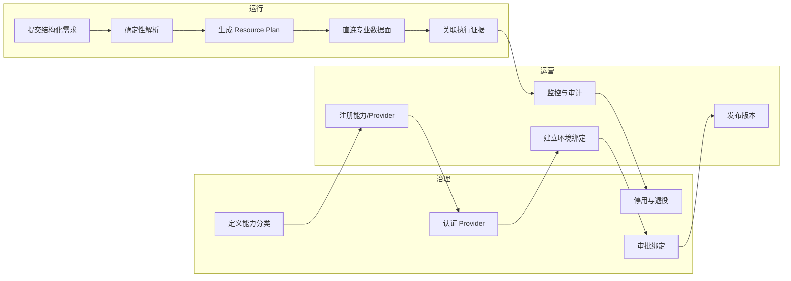
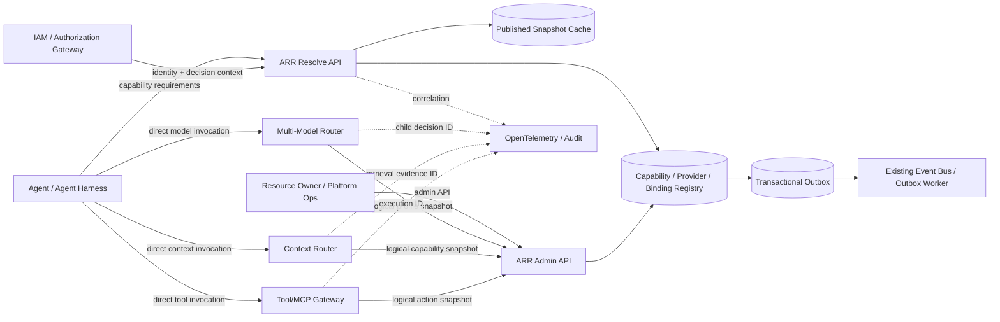
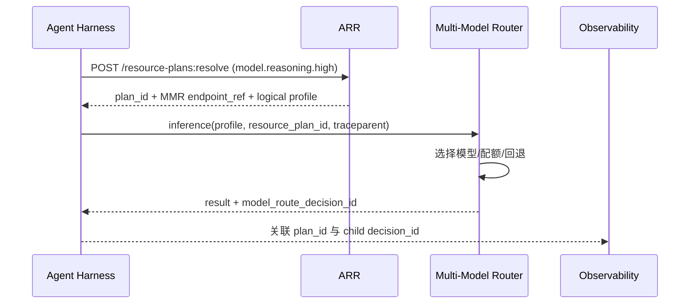
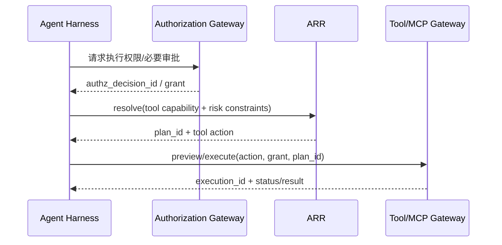
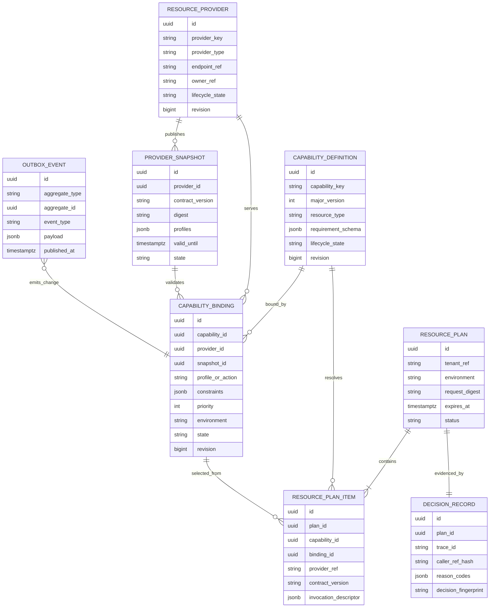
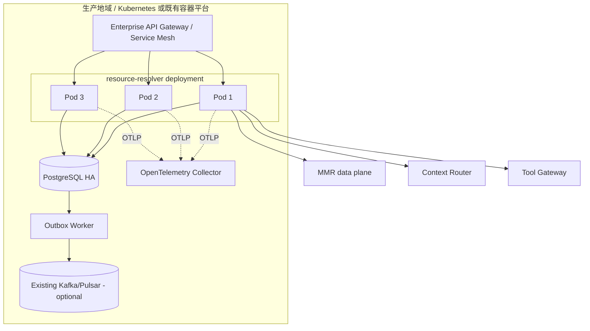

# AI Resource Router 子项目 4A 总体架构

## 1. 架构结论

本项目是 **03 Sovereign AI & Open AI Fabric** 的 `03.3 AI Resource Router` 子项目。它位于主权控制面，负责跨资源域能力解析。其中：

- 已建成的 **Multi-Model Router（MMR）** 是模型域唯一权威路由器，继续独立承载模型数据面；
- 新建的 **AI Resource Resolver（ARR）** 只把结构化能力需求解析为跨域 `Resource Plan`；
- Agent/Harness 按计划直接调用 MMR、Context Router、Tool/MCP Gateway，实际请求和响应不经过 ARR；
- 一期资源域为 `MODEL_PROVIDER`、`CONTEXT_PROVIDER`、`TOOL_PROVIDER`；`AGENT_PROVIDER` 在后续阶段达到准入条件后启用；
- ARR 不进行自然语言任务规划、具体模型选择、知识检索、工具执行、授权裁决、GPU 调度或业务事实存储。

03 工程统一产品治理、Capability 语义、开放标准、身份传递、证据和运维规范；ARR、MMR、MCP Fabric、A2A Fabric 和 Placement Fabric 是兄弟模块，专业数据面分离。ARR 可以复用 MMR 的技术栈、公共 SDK 和流水线，但保持独立部署与权威状态。

## 2. 目标、范围与成功标准

### 2.1 建设目标

1. Agent 不再硬编码各专业资源服务的地址、版本和环境差异。
2. 将 `capability_id → provider + profile/action` 的绑定变成版本化、可审批、可回滚的企业配置。
3. 让模型、上下文、工具域保持各自权威边界，同时形成统一追踪链。
4. 让资源变更不要求重新发布所有 Agent。
5. 用确定性解析替代新的“总路由算法”，避免与 MMR 重复建设。

### 2.2 范围

| 范围内 | 范围外及权威系统 |
|---|---|
| Capability、Provider、Binding、Snapshot 生命周期 | 模型选择、负载均衡、成本、配额、重试、回退：MMR |
| 结构化约束校验和确定性绑定解析 | 检索、重排、上下文装配：Context Router/Memory Service |
| Resource Plan 生成、版本和短期缓存 | 工具发现细节、凭证、执行和补偿：Tool/MCP Gateway |
| 父子决策 ID 和审计关联 | 身份认证、授权、人工审批：IAM/Authorization Gateway |
| Provider 粗粒度状态投影 | 模型实例、API 账号、MCP Server、GPU/K8s 实例管理 |
| 管理 API 与变更审计 | Prompt、Skill、Workflow、数据集、知识文档资产管理 |

### 2.3 一期量化验收基线

以下是设计基线，立项时由业务与 SRE 确认最终值：

| 指标 | 一期目标 |
|---|---:|
| Resolve API 可用性 | ≥ 99.9%/月 |
| Resolve API 延迟 | P95 ≤ 50 ms，P99 ≤ 100 ms（同地域、缓存命中） |
| 绑定变更生效 | P95 ≤ 60 s |
| Resource Plan 可追溯率 | 100% |
| 未授权管理变更 | 0 |
| MMR 内部模型切换引起的 ARR 配置变更 | 0 |
| 生产回滚时间 | ≤ 15 min |
| RTO / RPO | 60 min / 15 min；TODO-业务确认 |

容量基线暂记为 `TODO-峰值解析QPS`、`TODO-能力数量`、`TODO-Provider数量`、`TODO-工厂与区域数量`，在 Phase 0 压测前锁定。

## 3. 关键原则

1. **专业域权威唯一**：ARR 只保存跨域绑定，不复制专业路由器内部状态。
2. **控制面与数据面分离**：ARR 不代理模型流、上下文或工具结果。
3. **确定性优先**：一期只做约束过滤、优先级和稳定排序，不引入 LLM 或机器学习打分。
4. **默认拒绝不明确配置**：不存在唯一有效绑定时返回明确错误，不猜测 Provider。
5. **版本不可变**：已发布 Capability、Binding、Snapshot 以新版本演进，不原地改写历史。
6. **开源优先但边界优先**：复用成熟基础设施；产品特有的绑定语义和解析规则保持小型自研模块。
7. **契约先行**：OpenAPI、JSON Schema、CloudEvents 和兼容性测试先于实现。

## 4. 业务架构（Business Architecture）

### 4.1 业务能力地图

### 4.2 角色与职责

| 角色 | 核心职责 | 不承担 |
|---|---|---|
| AI Platform Product Owner | 范围、优先级、SLA、跨团队协调 | 专业域内部路由策略 |
| ARR 服务团队 | Registry、Binding、Resolve、Plan、审计 | 模型/检索/工具执行 |
| MMR 团队 | 逻辑模型 profile、模型数据面、子决策证据 | 跨资源域组合 |
| Context 平台团队 | 上下文能力、检索、来源与新鲜度证据 | 跨域绑定 |
| Tool/MCP 平台团队 | 工具契约、风险、执行状态、幂等 | ARR 的能力模型 |
| Resource Owner | Provider 元数据、SLA、生命周期和兼容性 | 审批自身高风险变更 |
| Security/IAM | 身份、权限策略、审批规则和审计要求 | Resource Plan 业务解析 |
| Agent 团队 | 声明能力需求、消费计划、传递关联 ID | 硬编码具体资源实例 |
| SRE | SLO、容量、发布、备份、事件响应 | 业务能力定义 |

### 4.3 RACI

| 活动 | ARR团队 | 专业Provider团队 | 安全/IAM | SRE | Agent团队 |
|---|---|---|---|---|---|
| 定义能力分类 | A/R | C | C | I | C |
| Provider 上线认证 | A | R | C | C | I |
| 生产 Binding 发布 | R | C | A（高风险） | C | I |
| Resolve 运行 | A/R | I | I | C | C |
| 专业资源执行 | I | A/R | C | C | C |
| 事故暂停 Provider | A/R | C | C | R | I |
| 退役与迁移 | A | R | C | C | C |

`A` 为最终负责，`R` 为执行，`C` 为协同评审，`I` 为知会。

### 4.4 核心业务流程

#### Provider 准入与发布

1. Resource Owner 提交 Provider 与逻辑能力契约，不提交底层实例和密钥。
2. 系统执行 Schema、兼容性、endpoint 引用、Owner、SLA 和数据级别检查。
3. 专业团队完成 Provider 契约测试；安全团队只对高风险工具或跨域数据访问审批。
4. 创建候选 Binding，双人复核后发布不可变版本。
5. 通过 Outbox 发布 `BindingActivated`，Resolver 缓存失效。
6. 在预生产运行契约测试后，按环境逐级推广。

#### 运行时解析与执行

1. Agent/Harness 从任务规划结果生成结构化 `capability_requirements`。
2. IAM 在入口完成调用方认证；ARR 使用身份上下文做约束匹配，不作最终授权裁决。
3. ARR 基于已发布快照进行确定性解析，返回带 TTL 和版本的 Resource Plan。
4. Harness 直接调用计划中的 MMR、Context Router 或 Tool Gateway。
5. 专业服务返回子决策/执行 ID；Harness 把 `resource_plan_id` 贯穿到追踪上下文。
6. 审计平台通过关联 ID 汇总证据，不复制请求正文和业务敏感数据。

#### 变更与退役

1. 新版本与旧版本并行发布，旧计划在 TTL 内继续有效。
2. 先在预生产验证，再按租户/工厂/Agent allowlist 灰度。
3. 发现问题时切回前一 Binding 版本；不回滚专业服务内部版本。
4. 退役前查询依赖，设置 `deprecated_at` 和 `sunset_at`，到期后停止新解析。

### 4.5 价值指标

| 目标 | 指标 |
|---|---|
| 降低耦合 | 单次 Provider 变更触发的 Agent 发布数量 |
| 提高治理 | 有 Owner、SLA、数据分类、生命周期的资源比例 |
| 提高稳定性 | 解析失败率、过期快照使用率、错误绑定事故数 |
| 提高可审计性 | 父计划与子执行证据关联成功率 |
| 控制复杂度 | ARR 规则数量、非确定性规则数量（目标为 0） |

## 5. 应用架构（Application Architecture）

### 5.1 系统上下文

### 5.2 ARR 内部模块

一期实现为一个模块化单体、一个 PostgreSQL schema、一个部署单元：

| 模块 | 职责 | 主要输入/输出 |
|---|---|---|
| Resolve API | 接收结构化需求、鉴别契约版本、返回 Plan | `ResolveRequest → ResourcePlan` |
| Admin API | 管理 Capability、Provider、Binding、Snapshot | 版本化管理命令 |
| Capability Registry | 能力语义、输入约束、生命周期 | `CapabilityDefinition` |
| Provider Registry | 专业服务入口引用、Owner、SLA、域类型 | `ResourceProvider` |
| Binding Manager | 能力与 Provider profile/action 的环境绑定 | `CapabilityBinding` |
| Snapshot Ingestor | 校验和激活专业域发布的逻辑快照 | `ProviderSnapshot` |
| Binding Resolver | 过滤、排序、唯一性检查 | `ResolutionDecision` |
| Plan Assembler | 生成不可变、带 TTL 的计划 | `ResourcePlan` |
| Decision Ledger | 记录输入摘要、版本、结果和原因码 | `DecisionRecord` |
| Outbox Publisher | 可靠发布配置变更与审计事件 | CloudEvents |
| Projection Adapter | 向 Backstage/Resource Hub 提供只读投影 | Catalog projection |

禁止在一期拆成多个微服务。模块通过应用内端口隔离，以便未来仅在容量或组织边界成立时拆分。

### 5.3 确定性解析算法

对每项 capability requirement：

1. 按 `capability_id + requested_major_version` 读取已发布能力。
2. 读取当前环境、区域、租户范围内的 ACTIVE Binding。
3. 过滤生命周期无效、Snapshot 过期、数据分类不兼容、区域不兼容的候选。
4. 以 `binding_priority ASC, provider_id ASC, binding_version DESC` 稳定排序。
5. `selection_mode=SINGLE` 时必须得到唯一首选；同优先级冲突返回 `AMBIGUOUS_BINDING`。
6. 组装 `provider_id + endpoint_ref + profile_or_action + contract_version`。
7. 对规范化请求和已发布版本计算 `decision_fingerprint`，写 Decision Ledger。
8. 返回 `resource_plan_id`、`expires_at` 和所有决策原因码。

该算法不使用实时延迟、价格或模型质量打分。MMR 自己决定模型域的成本、质量、配额和回退。

### 5.4 主要时序

#### 模型能力

#### 工具能力

### 5.5 集成契约矩阵

| 对端 | ARR 消费 | ARR 提供 | 同步失败策略 |
|---|---|---|---|
| MMR | 逻辑 profile Snapshot、粗粒度状态 | `resource_plan_id`、需求约束 | Snapshot 未过期可继续解析；模型执行失败由 MMR 返回 |
| Context Router | 逻辑 context capability、契约版本 | 计划和追踪上下文 | 不回退到直接数据库；返回 Provider 不可用 |
| Tool/MCP Gateway | 逻辑 action、风险、幂等属性 | 计划、授权引用、追踪上下文 | 高风险工具 fail closed |
| IAM/Authz | 身份声明、决策/授权引用 | 资源属性、操作上下文 | IAM 不可用时管理面关闭；运行面按企业策略 fail closed |
| Resource Hub/Backstage | 无权威输入 | 只读目录投影 | 不影响运行时解析 |
| Observability | 无 | OTLP telemetry、关联 ID | 不阻塞解析；本地有界缓冲 |

### 5.6 接口分层

- Public Runtime API：只含 Resolve 和按 ID 查询短期 Plan。
- Management API：Capability、Provider、Binding、Snapshot、发布和回滚。
- Provider Adapter API：专业平台发布逻辑快照，不暴露内部实例。
- Projection API：门户和报表使用，禁止用于运行时解析。
- Event API：配置变化和审计通知，不参与同步主路径。

详细接口见 [resource-resolver-api.md](../specs/resource-resolver-api.md)。

## 6. 数据架构（Data Architecture）

### 6.1 权威数据边界

| 数据 | 权威系统 | ARR 保存形式 |
|---|---|---|
| Capability 定义 | ARR | 完整版本化定义 |
| 跨域 Provider 与 Binding | ARR | 完整版本化定义 |
| MMR 逻辑 profile | MMR | 签名/校验后的只读 Snapshot |
| 具体模型、权重、价格、密钥 | MMR | 不保存 |
| Context 文档、向量、检索结果 | Context Service | 不保存 |
| Tool 凭证、参数正文、执行结果 | Tool Gateway | 不保存 |
| 身份、角色、授权策略 | IAM/Authz | 只保存 ID 引用和必要声明摘要 |
| Resource Plan / Decision | ARR | 元数据、版本、原因码、摘要 |

### 6.2 概念模型

### 6.3 物理设计规则

- PostgreSQL 单独 schema `ai_resource_resolver`，MMR 不得直接读写该 schema。
- 所有表包含 `created_at`、`created_by`、`updated_at`、`revision`；管理写使用乐观锁。
- 业务唯一约束：`capability_key + major_version + revision`、`provider_key + revision`。
- ACTIVE Binding 的唯一性按 `capability_id + environment + scope_hash + priority` 约束或发布时校验。
- JSONB 只承载开放扩展字段；参与过滤和约束的字段必须提升为显式列并建索引。
- `resource_plan` 和 `decision_record` 按月分区；默认保留 90 天，审计保留期由 `TODO-合规负责人` 确认。
- Request 只保存规范化摘要，不保存 Prompt、上下文内容、工具参数正文和模型响应。
- Outbox 与业务事务同库提交；消费者按 `event_id` 幂等。
- 数据迁移只能前向兼容：先扩展、双读/双写、迁移、再收缩。

### 6.4 一致性模型

- 管理写入：强一致事务。
- Resolve：读取最新已发布快照；本地缓存最终一致，依靠 revision 和短 TTL 收敛。
- 事件：至少一次投递；消费者幂等，不宣称 exactly-once。
- 专业 Snapshot：签名或摘要校验；超出 `valid_until` 不用于新计划。
- 已生成 Plan：在 TTL 内不可变；Provider 可因安全事件被全局 suspend，此时执行端仍须再次检查 Provider 状态/授权。

### 6.5 数据分类

| 级别 | 示例 | 控制 |
|---|---|---|
| Internal | capability key、公开逻辑 profile | TLS、RBAC、审计 |
| Confidential | endpoint_ref、工厂/租户 scope、SLA | 字段脱敏、最小权限、静态加密 |
| Restricted | caller identity hash、授权决定引用 | 严格保留期、访问审计、禁止进指标标签 |
| Prohibited | 密钥、Prompt 正文、业务载荷、模型响应 | ARR 拒绝接收和持久化 |

详细表结构、事件与保留策略见 [resource-resolver-events-and-data.md](../specs/resource-resolver-events-and-data.md)。

## 7. 技术架构（Technology Architecture）

### 7.1 部署拓扑

ARR 无状态运行 3 个副本，跨故障域分布；Readiness 必须验证数据库和当前发布快照可读。MMR、Context、Tool 各自独立扩缩容。若企业不是 Kubernetes 环境，沿用 MMR 的 VM/容器编排基线，但保持相同的部署和故障域原则。

### 7.2 主路径开源组件

| 能力 | 选择 | 责任边界 | 许可证 | 采用条件 |
|---|---|---|---|---|
| 权威存储 | PostgreSQL | Registry、Plan、Decision、Outbox | PostgreSQL License | 复用企业 HA、备份、监控基线 |
| API 契约 | OpenAPI + JSON Schema | 同步 API 与结构校验 | Apache-2.0 / 标准规范 | 生成代码仅作为 DTO/客户端，不侵入领域模型 |
| 事件信封 | CloudEvents | 事件元数据互操作 | Apache-2.0 | 业务 payload 仍由本项目版本化 |
| 遥测 | OpenTelemetry SDK/Collector | traces、metrics、logs 采集和传递 | Apache-2.0 | 复用现有后端，ARR 不自建观测平台 |
| 运行平台 | 企业既有 Kubernetes | 调度、健康检查、滚动发布 | Apache-2.0 | 仅当 MMR 已使用；否则沿用 MMR 平台 |
| 数据库迁移 | MMR 已采用的 Flyway/Liquibase 等 | Schema migration | 依实际组件 | 不并存两套迁移工具 |
| 测试环境 | Testcontainers | PostgreSQL/契约集成测试 | MIT | CI 能运行容器时采用 |

技术栈基线见 [03 工程技术栈设计](./technology-stack.md)：默认使用 Go 1.27.x；若 Phase 0 证明 MMR 已有可复用的 Java/Spring Boot 公共 SDK 和企业生产基线，则按 ADR 覆盖规则切换为 Java 25 LTS + Spring Boot 4.1.x。无论使用哪种语言，鉴权、服务发现、错误模型、OTel 和 CI/CD 必须与 MMR 对齐，不能长期维护两套工程体系。

### 7.3 可选或实验组件

| 组件 | 用途 | 状态 | 准入门槛 |
|---|---|---|---|
| Backstage Software Catalog | AI Resource Hub 的浏览、Owner、文档入口 | 可选只读投影 | 企业已有 Backstage；不得成为运行时 SoT |
| xRegistry spec/server | Registry 互操作模型与工具验证 | 实验 PoC | 当前规范为 1.0 RC；须验证扩展模型、版本兼容、性能和升级路径 |
| OPA | 外部授权/发布准入策略 | 可选，由 IAM 项目持有 | 企业没有统一 PDP 且策略复杂度已超过代码规则；ARR 只消费决定 |
| Kafka/Pulsar | 跨团队事件分发 | 可选复用 | 已有平台或消费者/重放/吞吐达到明确阈值 |
| Valkey | 分布式缓存 | 二期候选 | 单进程缓存无法满足跨实例失效或数据库保护目标，经压测证明需要 |

### 7.4 保持自研的领域能力

以下能力没有成熟项目可以在不破坏边界的前提下直接替代，采用最小可替换实现：

- Capability/Provider/Binding 的企业语义和发布不变量；
- 结构化约束匹配与稳定排序；
- Resource Plan 组装和父子决策关联；
- MMR/Context/Tool 逻辑 Snapshot 适配器；
- 生产发布、回滚、暂停的领域工作流（简单状态机，不引入工作流引擎）。

这些模块只依赖内部端口和标准 JSON 契约；Registry 存储、PDP、事件总线、门户均可替换。

### 7.5 明确不采用

| 候选 | 结论 | 原因 |
|---|---|---|
| LiteLLM、Envoy AI Gateway、Higress、APISIX AI Gateway | 本项目不采用 | 属于模型/流量网关，MMR 已建成且是模型域权威 |
| Backstage 作为运行时 Registry | 否决 | 官方定位是软件目录和缓存视图，不适合动态权威绑定和低延迟解析 |
| Consul 作为能力 Registry | 否决 | 面向服务发现；当前版本采用 BUSL，且不表达本项目领域版本和绑定不变量 |
| Crossplane/KServe/vLLM | 本项目不采用 | 负责基础设施/模型部署与推理，不属于 ARR 边界 |
| Temporal/Camunda | 一期否决 | 生命周期发布是短事务状态机，没有长事务编排需求 |
| 独立规则引擎/LLM Router | 一期否决 | 解析规则少且确定，新增引擎会放大运维和解释成本 |
| Elasticsearch/图数据库/向量数据库 | 否决 | ARR 不做全文、关系推理或语义检索 |

完整候选比较和退出条件见第 12 节 ADR。

### 7.6 安全架构

- 北向 API 使用企业 OIDC/OAuth2；服务间使用 mTLS 或企业 workload identity。
- `endpoint_ref` 是服务发现引用，不允许保存 URL 中的用户名、Token 或密钥。
- 运行 API 只允许 `resource.resolve`；管理 API 分离 `resource.read/write/publish/suspend`。
- 生产发布、高风险工具 Binding、跨区域数据 Binding 需要双人审批；审批由 IAM/ITSM 持有，ARR 保存决定引用。
- 管理变更记录 before/after digest、actor、reason、ticket_ref、trace_id。
- 对 API 请求执行 Schema 大小、数组项数、字符串长度限制；未知字段按契约版本处理。
- 日志禁止记录身份 Token、Prompt、上下文正文、工具参数和模型输出。
- 依赖镜像使用固定 digest，CI 生成 SBOM、许可证清单和漏洞扫描报告。

#### 7.6.1 主要威胁与控制

| 威胁 | 典型路径 | 核心控制 | 验证证据 |
|---|---|---|---|
| 身份伪造 | 伪造 Agent/Provider 发布 Snapshot | OIDC、mTLS/workload identity、issuer/audience 校验 | 负向认证测试、证书轮转演练 |
| 配置篡改 | 越权修改 Binding 或 Snapshot | RBAC、乐观锁、签名/digest、双人审批 | Change Record、篡改测试 |
| 重放 | 重复发布或执行旧管理命令 | Idempotency-Key、版本单调、有效期 | 重放测试、409/幂等证据 |
| 信息泄露 | 日志/事件写入 Prompt、密钥或参数 | Schema 禁止字段、日志脱敏、DLP/secret scan | CI 扫描和生产抽检 |
| 拒绝服务 | 大请求、缓存击穿、恶意高基数 | 请求上限、限流、有界缓存、single-flight、标签白名单 | 压测和限流演练 |
| 权限提升 | 普通 Owner 发布生产或高风险工具 | 权限分离、外部审批决定、管理面隔离 | IAM 审计与越权测试 |
| 供应链攻击 | 恶意依赖或镜像 | 锁版本、SBOM、SCA、签名和准入验证 | 发布门禁记录 |

### 7.7 可观测性

核心指标：

- `arr_resolve_requests_total{result,error_code,resource_type}`
- `arr_resolve_duration_seconds`
- `arr_binding_candidates{capability_id}`（限制标签基数）
- `arr_snapshot_age_seconds{provider_id}`
- `arr_plan_created_total{resource_type}`
- `arr_outbox_lag_seconds`
- `arr_admin_changes_total{operation,result}`

Trace 属性使用 `resource.plan.id`、`ai.capability.id`、`ai.provider.id`、`deployment.environment`；用户 ID、Prompt 和工具参数不得作为属性或指标标签。

### 7.8 弹性与灾备

- 实例无状态、跨故障域；本地 Caffeine/语言等价缓存，TTL 30–60 秒并由 revision 失效。
- 数据库连接池有界，超时短于上游超时；限流按 caller/tenant 执行。
- 数据库不可用时，只可用已验证、未过期的只读发布快照继续解析；不得接受管理写。
- 过期 Snapshot 默认不生成新计划；紧急例外必须是有时限、有审批、有审计的 break-glass 配置。
- PostgreSQL 每日全量 + 连续归档/PITR；每季度恢复演练。
- 灾备环境预置应用和 schema，配置通过备份恢复或受控复制，不通过手工重建。

## 8. 资源域契约

| 资源域 | 控制面契约 | 数据面契约 | 必须返回的证据 |
|---|---|---|---|
| MODEL_PROVIDER | logical profile、约束 Schema、粗粒度状态、版本 | MMR inference API | `model_route_decision_id`、用量/状态引用 |
| CONTEXT_PROVIDER | context capability、数据分类、区域、新鲜度能力 | retrieve/assemble API | `retrieval_evidence_id`、source/freshness 摘要 |
| TOOL_PROVIDER | action schema、风险、幂等、审批要求 | preview/execute/status/cancel | `execution_id`、`authz_decision_id`、结果摘要引用 |
| AGENT_PROVIDER（后续可选） | capability、owner、delegation、SLA | submit/status/cancel | `child_task_id`、最终状态、证据引用 |

Provider 不得把底层实例目录泄露到 ARR。详细契约见既有 [ai-resource-router.md](./ai-resource-router.md)。

## 9. 非功能需求

| 类别 | 要求 |
|---|---|
| 性能 | 单次请求最多 20 个 capability；请求体 ≤ 256 KiB；P99 目标见 2.3 |
| 可用性 | 无单点；解析面和管理面隔离限流；管理故障不得耗尽运行线程池 |
| 扩展性 | 支持 10 倍当前基线；只通过水平扩容应用和数据库读优化扩展 |
| 兼容性 | API major version 路径隔离；minor 只允许向后兼容字段 |
| 安全 | 全链路身份、最小权限、敏感数据不落地、生产变更双人复核 |
| 审计 | 每个 Plan 都能还原所用 Capability/Binding/Snapshot 版本和原因码 |
| 可维护性 | 圈复杂度和模块依赖受 CI 约束；核心解析规则表驱动测试 |
| 可移植性 | 不在领域代码使用云厂商专有 API；通过 adapter 使用发现、消息和 IAM |

## 10. 发布、迁移与兼容策略

1. ARR 上线前，MMR 仍按原接口服务，不要求一次性改造所有 Agent。
2. 首批选择 1 个模型能力、1 个上下文能力、1 个低风险只读工具做薄切片。
3. Harness 增加 Resource Plan 消费能力，并保留受控 feature flag 回退到旧静态配置。
4. 双轨期比对旧配置与 ARR 决策，不让 ARR 结果进入生产执行。
5. 达标后按 Agent allowlist 启用；每批观察一个完整业务周期。
6. 旧静态配置只在回滚窗口保留，最终冻结写入并退役。

兼容规则：

- Capability key 永不复用；破坏性变化升 major。
- Provider profile/action 破坏性变化先并行发布新版本。
- ARR 对旧 Harness 至少支持 N-1 major，具体期限 `TODO-平台版本政策`。
- MMR 内部模型和路由规则变化不触发 ARR 版本变更。

## 11. 实施分解与验收

### 11.1 交付增量

| 阶段 | 主要产物 | 退出条件 |
|---|---|---|
| Phase 0 契约与 PoC | MMR 契约盘点、OpenAPI/Schema、PostgreSQL PoC、开源组件 ADR | 最难约束验证通过，范围和容量签字 |
| Phase 1 最小闭环 | Registry、Binding、Resolve、Plan、MMR adapter、Ledger | 模型能力端到端，MMR 内部切换不改 ARR |
| Phase 2 三域接入 | Context/Tool adapter、IAM、审批引用、事件与门户投影 | 三域契约测试和安全评审通过 |
| Phase 3 生产化 | HA、压测、灾备、灰度、Runbook、SLO dashboard | 演练和生产准入清单全部通过 |
| Phase 4 可选扩展 | Agent Provider、xRegistry/OPA/Kafka 评估 | 只在触发门槛成立后启动 |

### 11.2 架构验收场景

1. 同一输入和同一发布版本产生同一 `decision_fingerprint`。
2. MMR 将内部模型 A 切到 B，ARR 无配置修改、Agent 无重新发布。
3. 过期 MMR Snapshot 不产生新计划，并返回可操作错误。
4. 同优先级冲突 Binding 返回 `AMBIGUOUS_BINDING`，不随机选择。
5. Resource Plan 能关联 MMR 的 `model_route_decision_id`，但 ARR 查不到模型细节。
6. 工具执行前缺少授权决定时，由 Tool Gateway/Authorization Gateway 拒绝。
7. PostgreSQL 短暂不可用时，未过期发布快照可读；管理写被拒绝。
8. 回滚 Binding 后 60 秒内新请求使用上一稳定版本，旧 Plan 在 TTL 内保持不变。
9. 日志、Trace、事件扫描不出现 Prompt、密钥、工具参数或模型响应。
10. 单个 Provider/租户流量异常不会耗尽全局解析资源。

详细计划见 [resource-resolver-implementation-plan.md](../plans/resource-resolver-implementation-plan.md)。

## 12. Architecture Decision Records

### ADR-001：归属 03 工程，专业数据面分离

- **决定**：ARR 是 03 Sovereign AI & Open AI Fabric 的主权控制面子项目；MMR、MCP、A2A 和 Placement 是同级专业模块。ARR 是跨域解析面，MMR 继续是独立模型数据面。
- **原因**：统一治理和体验，同时保留性能、故障和权威边界。
- **替代方案**：合并为单一进程；因模型流量和控制面生命周期不同而否决。
- **退出条件**：若未来 03 主权控制面的模块容量和发布节奏一致，可合并 ARR、Registry 和 Policy 的控制面部署；MMR 数据面仍独立。

### ADR-002：PostgreSQL 为 ARR 唯一权威库

- **决定**：使用企业现有 PostgreSQL HA。
- **候选**：PostgreSQL、etcd、Consul、文档数据库。
- **原因**：事务、约束、JSONB、审计、Outbox 与团队运维成熟度匹配。
- **限制**：极高读吞吐需缓存；跨地域强一致不在一期目标。
- **许可证**：PostgreSQL License。
- **退出条件**：实测容量超过经调优和读扩展后的上限，或企业数据库标准改变。

### ADR-003：Runtime Registry 使用小型领域实现

- **决定**：以 PostgreSQL + 本项目领域模型实现；不把 Backstage/xRegistry/Consul 直接放入主路径。
- **候选**：Backstage、xRegistry、Consul、自研。
- **原因**：Backstage 官方建议目录不是最终 SoT 且不适合实时动态关系；xRegistry 仍为 1.0 RC，适合互操作 PoC；Consul 是服务发现且当前 BUSL；跨域 Binding 和 Plan 是本项目特有不变量。
- **限制**：需维护约 6–8 个领域实体和 API；通过 OpenAPI/JSON Schema 和 adapter 限制锁定。
- **退出条件**：xRegistry 发布稳定版本并通过本项目扩展、性能、迁移和运维 PoC，可替换 Registry adapter。

### ADR-004：不引入规则或工作流引擎

- **决定**：确定性解析使用普通领域代码；发布流程使用数据库状态机。
- **候选**：OPA、Drools、Temporal/Camunda、领域代码。
- **原因**：一期规则少、可枚举、要求可重复；复杂引擎没有收益。
- **退出条件**：授权策略由多团队频繁独立变更时接企业 PDP；存在跨日补偿和外部人工等待的长事务时再评估工作流引擎。

### ADR-005：CloudEvents + Transactional Outbox

- **决定**：事件采用 CloudEvents 信封，业务事件版本化；一期使用 PostgreSQL Outbox Worker。
- **候选**：直接 Kafka 双写、CDC/Debezium、Outbox。
- **原因**：避免双写不一致；一期吞吐不需要新增 CDC 平台。
- **限制**：至少一次投递，消费者必须幂等。
- **退出条件**：已有 Debezium 平台且 outbox polling 对数据库造成经验证的压力时切换 CDC adapter。

### ADR-006：Backstage 仅作 Resource Hub 投影

- **决定**：企业已有 Backstage 时同步 Owner、文档、API 和生命周期摘要。
- **原因**：复用成熟门户与目录体验，同时保持 ARR 权威性。
- **许可证**：Apache-2.0。
- **退出条件**：企业选择其他门户时替换 Projection Adapter，不影响运行时。

## 13. 未决项

| ID | 未决项 | Owner | 截止点 |
|---|---|---|---|
| TODO-01 | MMR 语言、框架、API、鉴权、profile Snapshot、事件和 OTel 规范 | MMR负责人 | Phase 0 第 1 周 |
| TODO-02 | 峰值 QPS、能力/Provider 数量、工厂与区域规模 | 产品负责人/SRE | Phase 0 第 1 周 |
| TODO-03 | 审计和 Plan 保留期、数据驻留要求 | 合规负责人 | Phase 0 结束 |
| TODO-04 | IAM/PDP 和双人审批接入方式 | 安全负责人 | Phase 0 结束 |
| TODO-05 | Context Router 与 Tool Gateway 当前成熟度和接口 | 各域负责人 | Phase 1 结束前 |
| TODO-06 | RTO/RPO 和跨地域灾备等级 | 业务负责人/SRE | 生产设计评审 |

## 14. 官方参考

- [Backstage Software Catalog](https://backstage.io/docs/features/software-catalog/)
- [Backstage Catalog Graph：目录不应作为最终权威源](https://backstage.io/docs/features/software-catalog/creating-the-catalog-graph/)
- [xRegistry specification and reference implementation](https://github.com/xregistry/spec)
- [Open Policy Agent](https://github.com/open-policy-agent/opa)
- [CloudEvents specification](https://github.com/cloudevents/spec)
- [OpenAPI Specification](https://spec.openapis.org/oas/latest.html)
- [OpenTelemetry documentation](https://opentelemetry.io/docs/what-is-opentelemetry/)
- [Consul current license](https://github.com/hashicorp/consul/blob/main/LICENSE)
