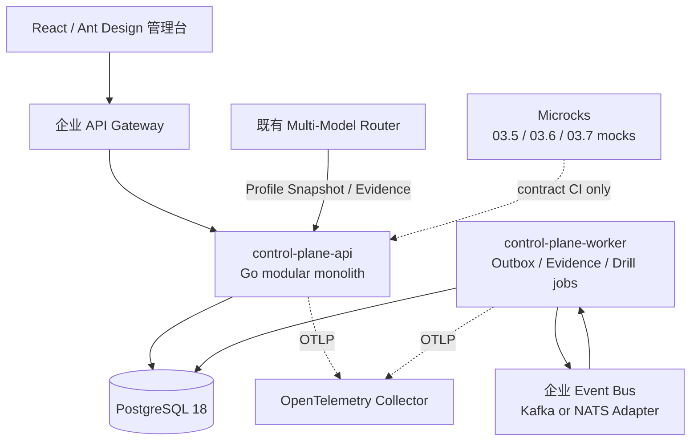

# 03 Sovereign AI & Open AI Fabric 技术栈设计

## 1. 决策摘要

本期推荐采用以下主路径：

| 层次 | 主选技术 | 决策 |
|---|---|---|
| 后端语言 | **Go 1.27.x** | 默认主选；若已建成 MMR 的主语言和公共 SDK 是 Java，则按第 4 节覆盖规则切换为 Java |
| 后端架构 | 模块化单体，API 与 Worker 两个进程形态 | 03.1/03.2 最小能力、03.3、03.8 同仓同版本，模块间禁止跨边界直接写表 |
| HTTP API | Go `net/http` + `chi` + `oapi-codegen` | OpenAPI 3.1 contract-first；生成 DTO、Server interface 和客户端，领域模型保持自有 |
| 权威数据库 | **PostgreSQL 18.x** | 保存 Policy、Capability、Provider、Binding、Plan、Evidence Index、Exit Pack、Drill、Outbox |
| 数据访问 | `pgx/v5` + `sqlc` | SQL-first、强类型生成；不引入重量 ORM 和隐式查询行为 |
| 数据库迁移 | `goose` | 单向可审查迁移；扩展/迁移/收缩分阶段执行 |
| 约束表达 | **CEL-Go** | 只承载类型化、无副作用的 eligibility 表达式；策略语义、版本和审批仍由本项目持有 |
| 事件可靠性 | PostgreSQL Transactional Outbox | 与领域状态同事务；内部 Worker 负责投递和重试 |
| 外部事件总线 | 复用企业现有 Kafka/NATS；参考部署用 NATS JetStream | 通过 `EventTransport` 端口隔离；本项目不建设企业消息平台 |
| 缓存 | 进程内不可变 Published Snapshot | Resolve 热路径不逐次访问数据库；不在一期引入分布式缓存 |
| 可观测 | OpenTelemetry SDK + Collector | 复用企业观测后端，统一关联 `trace_id/resource_plan_id/model_route_decision_id` |
| 身份 | 企业 OIDC/OAuth 2.1 + workload mTLS | 复用 04 Identity & Trust；Keycloak 仅作为开源参考环境 |
| 管理前端 | TypeScript + React 19 + Ant Design 6/ProComponents | Resource Hub、Evidence、Exit Pack、Drill 和风险视图 |
| 接口 Mock/测试 | Microcks + Testcontainers + Schemathesis | 03.5/03.6/03.7 只生成 Mock、Stub 与契约测试，不建设运行时 |
| 部署 | OCI Image + Kubernetes/Helm | 复用 MMR/企业平台；数据库已有托管能力优先，否则评估 CloudNativePG |
| 供应链 | Trivy + Syft/CycloneDX + Cosign | 漏洞/许可证扫描、SBOM、镜像签名和 digest 准入 |

**不选择“大而全 AI 平台框架”作为本项目基础。** 本项目是主权控制面，不处理模型 Prompt、工具参数、Agent 消息或推理流量。模型路由继续由既有 MMR 负责。

## 2. 本期范围对技术栈的约束

| 模块 | 本期状态 | 技术栈处理方式 |
|---|---|---|
| 03.1 Governance & Policy | 最小实现 | Policy Set、约束 Schema、版本和决定引用；不自建 IAM/PDP |
| 03.2 Registry & Resource Hub | 最小实现 | 自有权威数据模型与管理 UI；Backstage/xRegistry 只作可替换投影或实验适配 |
| 03.3 AI Resource Router | 完整实现 | Go 领域模块、不可变 Snapshot、确定性 Resolver、Runtime/Admin API |
| 03.4 Multi-Model Router | 已实现 | 只开发 `MMRAdapter`、Snapshot Publisher/Consumer 和父子决策关联 |
| 03.5 MCP Fabric | 不实现运行时 | OpenAPI/JSON Schema/CloudEvents、Microcks Mock、契约测试 |
| 03.6 A2A Fabric | 不实现运行时 | Agent Card/Task/Event 契约、Microcks Mock、契约测试 |
| 03.7 Placement Fabric | 不实现运行时 | Placement/Profile/Plan 契约、Mock、契约测试 |
| 03.8 Sovereignty Ops | 完整实现 | Evidence Index、指标、Exit Pack、Drill、风险告警和 Dashboard |

## 3. 目标架构



### 3.1 部署单元

| 部署单元 | 内容 | 扩缩容依据 |
|---|---|---|
| `control-plane-api` | Runtime/Admin API、Policy、Registry、Resolver、Ops Query | Resolve/Admin QPS、P99、连接池 |
| `control-plane-worker` | Outbox、Snapshot ingestion、Evidence consumer、指标聚合、Drill timer | backlog、事件延迟、定时任务数量 |
| `control-plane-web` | Resource Hub 与 Sovereignty Ops 管理台 | 静态资源/CDN 或 Nginx |
| PostgreSQL | 四个逻辑 Schema 与 Outbox | 数据量、IOPS、WAL、连接数 |

API 与 Worker 使用同一代码仓库和领域包，但生成两个独立二进制。这样可以独立扩容和隔离后台任务，又不会在一期形成微服务分布式事务。

### 3.2 领域模块

```text
internal/
├── policy/                 # 03.1 minimum policy capability
├── registry/               # 03.2 capability/provider/binding lifecycle
├── resolver/               # 03.3 deterministic resource planning
├── sovereigntyops/         # 03.8 evidence/metrics/exit/drill
├── contracts/              # OpenAPI/Event generated types at the boundary
└── adapters/
    ├── mmr/
    ├── identity/
    ├── eventtransport/
    ├── telemetry/
    └── objectstore/
```

模块只能通过应用服务接口或领域事件交互。数据库按 `sovereignty_policy`、`capability_registry`、`resource_router`、`sovereignty_ops` 划分 Schema；只有所属模块可以写入其表。

## 4. 开发语言决策

### 4.1 推荐：Go 1.27.x

Go 适合本项目的原因：

- Resolve 是短请求、低延迟、高并发、无模型计算的控制面服务，Go 的标准 HTTP、并发和静态二进制特性与其匹配；
- pgx、sqlc、OpenTelemetry、NATS/Kafka、OIDC 和 Kubernetes 生态成熟；
- API 与 Worker 可共享领域包，同时保持小镜像、快速启动和较低资源占用；
- 显式错误处理和静态类型适合策略版本、资源计划与证据关联等审计敏感逻辑；
- 不需要 Python AI/ML 生态，因为本项目不执行模型、不运行 Agent，也不做语义检索。

基线使用当前稳定补丁版本，不固定使用 `.0`。Go 官方目前将 1.27 和 1.26 作为受支持版本，应在每次发布时更新到所选 minor 的最新安全补丁。

### 4.2 MMR 对齐覆盖规则

以下任一条件成立时，后端主语言改为 **Java 25 LTS + Spring Boot 4.1.x**，其余架构边界保持不变：

1. MMR 是 Java/Spring Boot，且已有可复用的鉴权、服务发现、错误模型、OTel、客户端和发布模板；
2. 交付团队 Java 生产经验显著高于 Go，无法在 Phase 0 完成 Go 运行能力验证；
3. 企业强制 Java 技术基线，Go 无法进入生产运维和安全支持体系。

若 MMR 是 Go，则直接采用 MMR 的 Go module、HTTP/gRPC、配置、日志和 CI 基线；本文列出的具体库只在 MMR 没有等价标准时采用。

### 4.3 语言候选比较

| 语言 | 适配度 | 优点 | 主要代价 | 结论 |
|---|---:|---|---|---|
| Go | 高 | 云原生生态、静态二进制、并发、资源占用、部署简单 | 团队需具备 Go 工程能力 | 默认主选 |
| Java | 高 | 企业治理、事务、IAM、成熟团队与 Spring 生态 | 内存和启动成本较高 | MMR/企业 Java 基线时主选 |
| Rust | 中 | 性能、安全、低资源 | 开发速度和人才成本与本项目收益不匹配 | 不作为一期主语言 |
| Python | 中低 | 原型快、数据工具丰富 | 核心控制面类型约束、吞吐和长期维护成本较高 | 只用于离线工具/PoC |
| TypeScript/Node.js | 中 | 与前端统一、API 开发快 | 后端运行和依赖治理收益不高于 Go/Java | 只用于前端 |

## 5. 后端技术栈

### 5.1 API 与契约

| 能力 | 主选 | 二次开发内容 | 边界 |
|---|---|---|---|
| HTTP Server | Go `net/http` + `chi` | 中间件、错误模型、限流入口、请求关联 | 不二次封装通用 Web 框架 |
| Contract-first | OpenAPI 3.1 + JSON Schema 2020-12 | SAOAF API/Schema、兼容规则和示例 | 契约是源，生成代码不是领域模型 |
| 代码生成 | `oapi-codegen` | 自定义模板仅限错误/分页等稳定公共结构 | 固定发布版本；OpenAPI 3.1 能力做 PoC |
| 事件信封 | CloudEvents 1.0 + AsyncAPI 3 | 领域事件 payload、subject、partition key | EventTransport 可替换 |
| MMR 集成 | 手写薄 Adapter + 生成客户端 | profile 映射、identity、超时、错误透传、decision ID | 不复制 MMR 路由逻辑 |

REST/JSON 是北向和管理面默认协议。只有 MMR 已使用 gRPC 且复用价值明确时，MMR Adapter 使用 gRPC；不为内部模块引入 RPC。

### 5.2 数据与一致性

| 能力 | 主选 | 设计 |
|---|---|---|
| OLTP | PostgreSQL 18.x | 主键 UUIDv7；关键对象带 tenant、version、digest、status 和审计字段 |
| 数据访问 | pgx + sqlc | SQL 显式审查；领域层不依赖 pgx/sqlc 生成类型 |
| 迁移 | goose | expand → migrate → contract；生产收缩需单独窗口 |
| 并发控制 | 乐观锁 + 唯一约束 | 发布、绑定和状态迁移不依赖分布式锁 |
| 审计 | Append-only change/evidence index | 保存摘要和引用，不保存 Prompt、响应、工具参数正文 |
| 事件 | Transactional Outbox | 状态与事件同事务；至少一次投递，消费者幂等 |
| 搜索 | PostgreSQL 索引/全文能力 | 一期不引入 Elasticsearch/OpenSearch |
| 缓存 | Published Snapshot in memory | `snapshot_version` 原子切换；变更事件触发 reload |

PostgreSQL 18 的官方支持周期到 2030 年；若企业数据库标准仍为 16/17，应优先服从企业支持矩阵，代码不得依赖 18 独有语法。

### 5.3 Policy 与 Resolver

- Capability、Provider、Binding、生命周期、排序规则和 Resource Plan 组装为自有 Go 领域代码；
- 使用 canonical JSON + SHA-256 形成版本 digest；同一输入和 Snapshot 必须生成相同决策结果；
- CEL-Go 只用于管理员配置的类型化布尔条件，发布前完成 parse、type-check、cost limit 和测试样例验证；
- CEL 不能访问网络、数据库、当前时间或随机数，避免不可重复决策；
- OPA 只作为企业 PDP 适配候选，由 04 Identity & Trust 持有。ARR 消费 allow/deny/obligation 结果，不成为新的授权权威。

### 5.4 03.8 Sovereignty Operations

一期不引入通用工作流引擎。Exit Drill 使用显式有限状态机：

```text
DRAFT → APPROVED → SCHEDULED → RUNNING →
  SUCCEEDED | FAILED | ABORTED → REMEDIATION_OPEN → CLOSED
```

每次状态迁移使用数据库事务、乐观锁、Outbox 和幂等命令。满足以下任一条件后再评估 Temporal：

- 跨多个独立系统、持续数天并需要自动补偿；
- 并发长流程超过数据库定时扫描的容量基线；
- 需要工作流代码版本化、精确 replay 和复杂人工 signal；
- 现有状态机故障恢复成本经生产数据证明过高。

Temporal 为 MIT 许可证且具备 durable execution 能力，但一期引入会增加独立集群、SDK、升级和运维负担。Camunda 8 不进入主路径，原因是当前授权与本项目“宽松开源优先”的目标不匹配。

## 6. Resource Hub 与前端

推荐使用 TypeScript、React 19、Ant Design 6 和 ProComponents，采用 Vite 构建。页面范围限定为：

1. Capability/Provider/Binding 管理；
2. Published Snapshot 和 Resource Plan 查询；
3. Evidence 关联和证据完整率；
4. Exit Pack 管理；
5. Exit Drill 状态、发现项与整改；
6. 主权风险和替代覆盖率 Dashboard。

前端不保存策略权威状态，所有写操作调用 Admin API。OIDC Token 使用企业标准的 BFF 或安全 Cookie 方案；禁止把长期 Token 放入 localStorage。

Backstage 只在企业已经部署时作为只读目录投影：通过插件展示 Capability Owner、文档和健康摘要，不能直接写运行时 Binding，也不能成为 Resolver 的依赖。

## 7. 03.5/03.6/03.7 契约技术栈

| 能力 | 组件 | 用法 |
|---|---|---|
| REST Mock | Microcks | 导入 OpenAPI 示例，生成 03.5/03.6/03.7 Mock endpoint |
| Event Mock | Microcks + AsyncAPI | Kafka 类事件可直接模拟；NATS binding 在支持前使用应用内测试适配器 |
| Conformance | Microcks CLI | CI 检查实现是否符合 OpenAPI/AsyncAPI |
| API property test | Schemathesis | 根据 OpenAPI 生成边界与异常输入 |
| 集成环境 | Testcontainers for Go | PostgreSQL、NATS/Kafka、OIDC 测试依赖 |
| Consumer contract | Pact（可选） | 仅在多团队消费者演进冲突确实出现时采用 |

Microcks 当前支持 OpenAPI、AsyncAPI、gRPC 等 Mock 和一致性测试，采用 Apache-2.0；其 NATS AsyncAPI 测试支持不足，因此不能把它当作 NATS 事件测试的唯一工具。

## 8. 身份、安全与供应链

| 能力 | 主路径 | 说明 |
|---|---|---|
| 用户认证 | 企业 OIDC Provider | 本项目验证 issuer、audience、expiry 和 scope |
| 服务身份 | 企业 mTLS/workload identity | SPIFFE/SPIRE 仅在企业已采用时对接 |
| 本地/参考 IAM | Keycloak | Apache-2.0；用于开发、演示和契约测试，不自动进入生产 |
| Secret | 企业 Secret Manager | 本项目只接引用；开源参考可评估 OpenBao |
| SAST | gosec + govulncheck | CI 阻断高风险问题和已知 Go 漏洞 |
| 镜像/依赖扫描 | Trivy | 漏洞、misconfiguration、secret、license 扫描 |
| SBOM | Syft + CycloneDX/SPDX | 每个镜像生成并随制品归档 |
| 签名 | Cosign | 镜像、SBOM 和 provenance 使用 digest 签名 |

## 9. 可观测性

应用只绑定 OpenTelemetry API/SDK 和 OTLP，不绑定特定商业后端。必须传播和记录：

- `trace_id`、`tenant_id`、`resource_plan_id`；
- `policy_version`、`snapshot_version`、`provider_id`；
- `model_route_decision_id`（来自 MMR）；
- `evidence_id`、`exit_pack_id`、`drill_id`。

禁止把 Prompt、模型响应、Tool 参数、Agent 消息、Token 或凭证写入 span attribute、日志和 metric label。指标采用 Prometheus/OpenMetrics 语义；后端优先复用企业平台。Grafana 可作为独立部署的可视化工具，但其 AGPL-3.0 许可证要求必须经过法务确认，且不得复制其源码到本项目或把修改版静态链接进产品。

## 10. 开源组件采用分级

### 10.1 主路径组件

| 组件 | 责任 | 许可证 | 二次开发策略 | 替换条件 |
|---|---|---|---|---|
| PostgreSQL 18 | 权威状态与 Outbox | PostgreSQL License | Schema、索引、RLS/审计约束 | 企业数据库标准变化或容量 PoC 不通过 |
| pgx | PostgreSQL Driver/Pool | MIT | 仅封装 Repository port | 维护停滞或安全/兼容性问题 |
| sqlc | SQL 类型生成 | MIT | 自定义 query，不修改生成器 | 生成限制阻碍领域模型或版本不兼容 |
| chi | HTTP routing | MIT | 组合标准中间件，不 fork | MMR 已有等价 Go 框架 |
| oapi-codegen | OpenAPI Go 生成 | Apache-2.0 | 固定版本、生成边界类型 | 3.1 PoC 不通过则评估 ogen/手写边界 |
| CEL-Go | 类型化约束表达 | Apache-2.0 | 注册受控变量/函数，不 fork | 规则无需配置则退回纯 Go；复杂 PDP 交给 04/OPA |
| OpenTelemetry | Telemetry/OTLP | Apache-2.0 | 只增加 SAOAF semantic attributes | 企业标准变更但保留 OTel export |
| Microcks | Mock/Conformance | Apache-2.0 | 加载本项目契约和示例，不 fork | 协议覆盖不足或运维成本过高 |
| React/Ant Design | 管理 UI | MIT | 自有页面和领域组件 | 企业门户标准变化 |

### 10.2 可选组件与采用门槛

| 组件 | 状态 | 采用门槛 |
|---|---|---|
| NATS JetStream | 参考 EventTransport | 企业无标准总线，且需要跨进程 durable event、重放和较低运维成本；需持续监控项目治理和许可证 |
| Apache Kafka | 企业总线适配 | 企业已有 Kafka，或消费者规模、保留期和重放需求证明值得复用 |
| Valkey | 二期缓存 | Snapshot 内存缓存和 PostgreSQL 保护经压测不满足目标；只缓存可重建数据 |
| CloudNativePG | PostgreSQL K8s 运维 | 企业没有托管 PostgreSQL，且 SRE 接受 Operator 生命周期和恢复演练责任 |
| Backstage | Resource Hub 投影 | 企业已有 Backstage；只读，不作 SoT |
| xRegistry | 实验适配 | 当前为 CNCF Sandbox、规范 v1.0 RC；稳定版发布并通过语义/性能/迁移 PoC 后再进入主路径 |
| OPA | 外部 PDP | 由 04 工程持有；复杂跨系统策略达到门槛，ARR 只消费决定 |
| Temporal | 二期 Drill workflow | 满足第 5.4 节长流程采用条件 |
| Keycloak | 参考 IAM | 开发/测试或企业明确选择；生产归 04 工程运维 |

### 10.3 明确不采用

| 候选 | 结论 | 原因 |
|---|---|---|
| LiteLLM、Envoy AI Gateway、Higress、APISIX AI Gateway | 不采用 | MMR 已实现，重复建设模型网关 |
| Elasticsearch/OpenSearch | 一期不采用 | PostgreSQL 足以支持当前目录和证据索引；避免新集群 |
| 图数据库/向量数据库 | 不采用 | 本项目不做知识图谱、关系推理或语义检索 |
| Redis 原项目 | 不新增 | 许可证演进增加治理成本；需要分布式缓存时优先 Valkey |
| Camunda 8 | 不采用 | 授权与宽松开源优先目标不一致，且一期不需要通用 BPM 引擎 |
| 自研消息队列/规则引擎/工作流引擎 | 不采用 | 使用现有组件或最小领域状态机，避免创建基础设施产品 |
| Backstage/xRegistry 作为权威 Registry | 不采用 | 无法直接表达并强制本项目的 Binding、发布和审计不变量 |

## 11. 建议仓库结构

```text
saoaf/
├── cmd/
│   ├── control-plane-api/
│   └── control-plane-worker/
├── internal/
│   ├── policy/
│   ├── registry/
│   ├── resolver/
│   ├── sovereigntyops/
│   ├── platform/
│   └── adapters/
├── contracts/
│   ├── openapi/
│   ├── asyncapi/
│   ├── jsonschema/
│   └── examples/
├── db/migrations/
├── web/
├── deploy/helm/
├── tests/
│   ├── contract/
│   ├── integration/
│   └── conformance/
├── docs/
├── go.mod
└── Makefile
```

不建议一期拆成 03.1、03.2、03.3、03.8 四个微服务。它们共享发布事务和一致性边界，拆分会引入分布式事务、事件最终一致和多套运维成本。代码模块和数据库 Schema 先隔离，为未来按容量或团队边界拆分保留端口。

## 12. Phase 0 PoC 与锁栈门禁

技术栈进入实现基线前，必须完成以下 PoC：

| PoC | 验证目标 | 通过标准 |
|---|---|---|
| POC-01 MMR 对接 | 真实 profile、鉴权、错误、trace、decision ID | 不修改 MMR 核心路由即可完成父子决策关联 |
| POC-02 Resolver 性能 | Published Snapshot + CEL + 稳定排序 | 达到已批准的 P99/QPS，结果完全确定性 |
| POC-03 Outbox/Evidence | 事务、重复、乱序、重放、隔离 | 无事件丢失；重复消费不产生重复证据 |
| POC-04 OpenAPI 生成 | OpenAPI 3.1 → Go server/client | 关键 oneOf/nullability/webhook Schema 正确且可兼容升级 |
| POC-05 Drill recovery | Worker 崩溃、重启、重复命令 | 状态机恢复正确，不重复执行外部动作 |
| POC-06 Contract-only fabrics | MCP/A2A/Placement Mock | 三类消费者在无真实运行时条件下完成契约测试 |
| POC-07 安全供应链 | OIDC/mTLS、SBOM、签名、扫描 | 安全基线和制品准入门禁全部通过 |

## 13. ADR 与退出条件

### ADR-TECH-001：默认使用 Go，MMR 对齐优先

- **状态**：Proposed
- **决策**：默认 Go 1.27.x；MMR/企业成熟 Java 基线满足第 4.2 节时切换为 Java 25 LTS + Spring Boot 4.1.x。
- **原因**：保持低延迟、小型控制面和云原生运维，同时避免为了语言偏好复制既有 MMR 工程体系。
- **退出条件**：Phase 0 发现 MMR 集成 SDK、企业支持矩阵或团队能力与 Go 明显冲突。

### ADR-TECH-002：PostgreSQL 是唯一权威状态

- **状态**：Proposed
- **决策**：Registry、Resolver、Ops 使用 PostgreSQL；缓存、搜索和消息均不成为权威来源。
- **退出条件**：容量/可用性 PoC 经调优、分区、读副本后仍无法满足批准目标。

### ADR-TECH-003：一期使用模块化单体

- **状态**：Proposed
- **决策**：API/Worker 分进程，同一领域代码库与数据库集群；模块通过端口和 Schema 隔离。
- **退出条件**：出现独立团队发布、显著不同容量/SLO、安全隔离或故障域需求，并有生产数据证明拆分收益。

### ADR-TECH-004：Drill 使用领域状态机

- **状态**：Proposed
- **决策**：一期不引入 Temporal/Camunda；数据库状态机 + Outbox 满足当前演练流程。
- **退出条件**：满足第 5.4 节任一 durable workflow 门槛后重新评估 Temporal。

## 14. 实现前待确认项

1. MMR 的主语言、框架、API/流式协议、认证、服务发现、OTel 和 CI/CD 基线；
2. 企业现有消息平台是 Kafka、NATS、Pulsar 还是无统一平台；
3. 企业 PostgreSQL 当前支持版本、HA、备份和 K8s 运维方式；
4. 04 Identity & Trust 的 OIDC issuer、scope、workload identity 和 PDP 接口；
5. Evidence 与审计数据的保留期、WORM/不可篡改要求及对象存储能力；
6. Resolve 的 QPS、P99、可用性和单租户/多租户目标。

在以上信息确认前，可以按 Go 主路径完成代码骨架和 PoC，但不得冻结生产版本号、连接池、分区、保留期和容量参数。

## 15. 主要参考

- [Go release history](https://go.dev/doc/devel/release)
- [PostgreSQL versioning policy](https://www.postgresql.org/support/versioning/)
- [oapi-codegen](https://github.com/oapi-codegen/oapi-codegen)
- [OpenTelemetry](https://opentelemetry.io/docs/)
- [Open Policy Agent](https://www.openpolicyagent.org/docs)
- [Microcks conformance testing](https://microcks.io/documentation/explanations/conformance-testing/)
- [xRegistry specification](https://github.com/xregistry/spec)
- [Temporal](https://github.com/temporalio/temporal)
- [CloudNativePG](https://github.com/cloudnative-pg/cloudnative-pg)
- [Ant Design Pro](https://github.com/ant-design/ant-design-pro)

