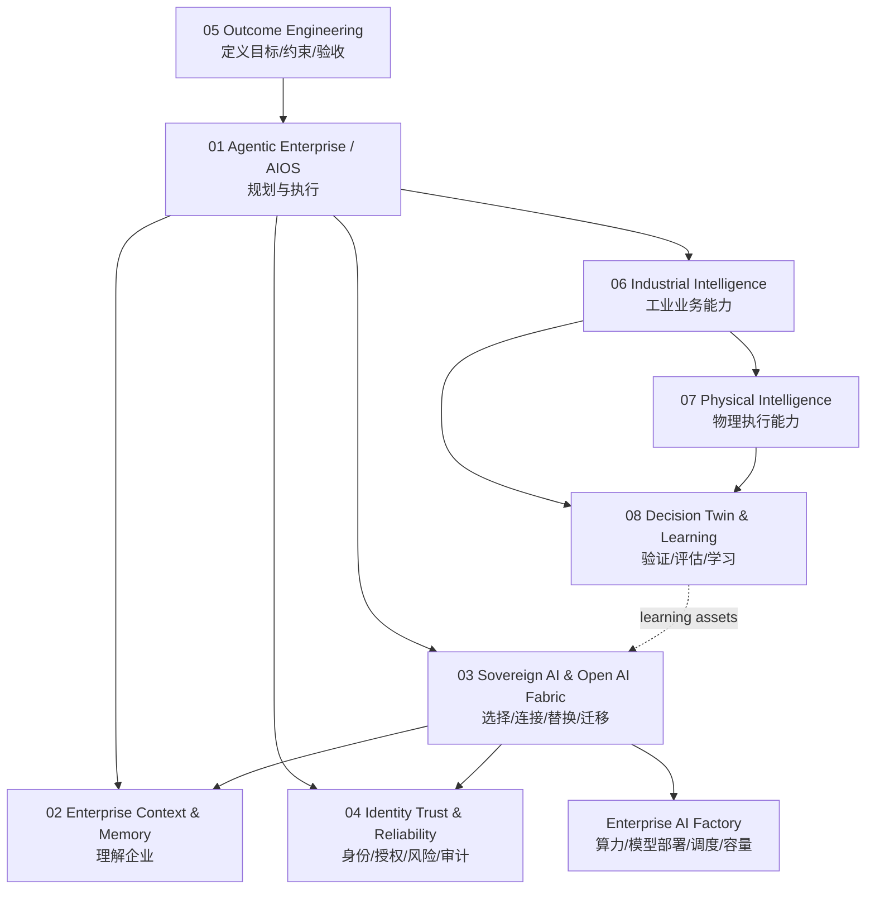
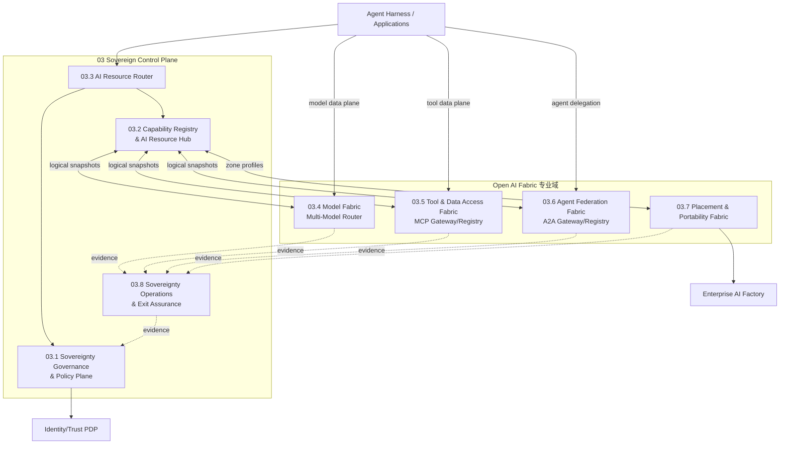
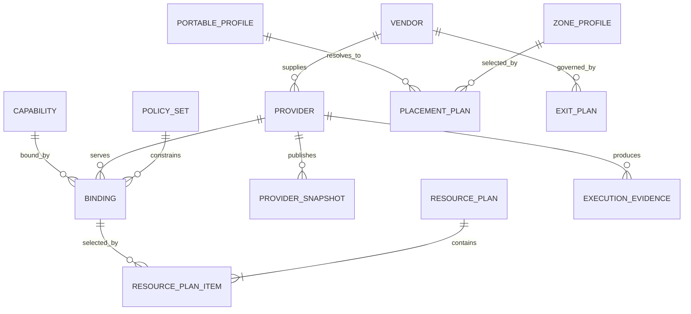

# 03 Sovereign AI & Open AI Fabric 总体架构与模块边界

## 1. 工程定位

**03 Sovereign AI & Open AI Fabric 是企业 AI 的主权控制与开放互操作工程。**

它解决的问题不是“所有 AI 能力都由一个平台实现”，而是：

> 当模型、云、算力、Agent 框架、工具协议和供应商发生变化时，企业仍能发现、选择、连接、替换、迁移并审计自己的 AI 能力。

本工程建立七类主权：

| 主权 | 企业必须控制 | 本工程手段 |
|---|---|---|
| Data Sovereignty | 数据去向、区域、用途、最小披露 | Policy、MCP 接入边界、数据分类约束 |
| Model Sovereignty | 模型可替换、路由可控、用量可见 | Model Abstraction、MMR、逻辑 profile |
| Compute Sovereignty | 云/私有/边缘可放置、可迁移 | Placement Profile、Portability Manifest |
| Context Sovereignty | Context 不被单一模型/平台锁定 | Context capability contract、引用而非复制 |
| Agent Sovereignty | Agent 可发现、可委派、可替换 | Agent Registry、A2A、稳定 capability ID |
| Operational Sovereignty | 可观测、可暂停、可回滚、可退出 | 控制面、证据链、kill switch、exit drill |
| Learning Sovereignty | 轨迹、评估、技能和适配资产归企业 | 资产归属/导出契约、Learning Factory 对接 |

## 2. 与 2027 总体战略的关系



03 工程是连接工程，不替代其他工程：

- Agentic Enterprise 决定怎样规划和执行任务；03 提供可选择、可连接的能力。
- Context & Memory 生产和装配 Context；03 只注册逻辑能力和连接契约。
- Identity & Trust 作身份、授权、风险和审批裁决；03 传播身份和消费决定。
- Enterprise AI Factory 部署模型、调度 GPU/NPU、管理容量；03 提供放置意图和可移植描述。
- Decision & Learning 管理轨迹、评估、优化和学习资产；03 定义资产归属、导出和可迁移契约。

## 3. 工程边界

### 3.1 工程内

1. 企业级 AI Capability ID、Provider contract 和开放协议规范。
2. 逻辑能力、Provider、Binding、兼容性和生命周期目录。
3. 跨资源域能力解析与 Resource Plan。
4. 模型抽象和 Multi-Model Router 集成。
5. MCP 工具/数据连接层与 A2A Agent 互操作层。
6. 云、私有、边缘的放置约束和可移植制品描述。
7. 供应商依赖度、替代覆盖率、导出能力、连续性和退出演练。
8. 跨模块关联 ID、配置证据和主权指标。

### 3.2 工程外

| 不负责 | 权威工程/系统 | 03 的关系 |
|---|---|---|
| Agent 规划、Harness、任务状态 | 01 Agentic Enterprise / AIOS | 消费 Resource Plan、MCP、A2A |
| Knowledge、Memory、Context 装配 | 02 Context & Memory | 注册 Context Provider；传递证据 ID |
| 身份、授权、审批、风险裁决 | 04 Identity Trust & Reliability | 传递身份；消费 authz/policy decision |
| 业务结果和验收标准 | 05 Outcome Engineering | 使用 capability contract，不定义业务结果 |
| MES/ERP/PLM/工业领域逻辑 | 06 Industrial Intelligence | 通过 MCP/API adapter 暴露受控能力 |
| 机器人/设备安全控制 | 07 Physical Intelligence | 只注册能力；不直接控制设备 |
| 仿真、评估、强化学习、蒸馏 | 08 Decision & Learning | 接收评估/学习资产引用和可移植要求 |
| GPU/NPU 部署、K8s 调度、模型 serving | Enterprise AI Factory | 下发 placement intent；消费容量/健康摘要 |
| API/MCP Server/Agent 的业务实现 | 各领域产品团队 | 03 提供标准、注册、连接和治理 |

### 3.3 明确禁止扩张

- 不建立第二套 IAM、PDP、审批和审计事实库。
- 不建立第二套 Context/Memory/Knowledge 平台。
- 不让 AI Resource Router 成为模型、工具和 Agent 的集中流量代理。
- 不在 Capability Registry 复制模型实例、文档、工具凭证或 Agent 内部 Prompt。
- 不以“主权”为理由自研云、容器、模型 Serving、消息系统或工作流引擎。
- 不把所有协议转换成私有企业协议；企业扩展必须有命名空间和退出路径。

## 4. 模块划分



### 4.1 03.1 Sovereignty Governance & Policy Plane

**负责**

- 七类主权政策模型、数据/区域/供应商/部署区约束；
- Provider 准入、认证、停用、退役和 break-glass 规则；
- 开放标准版本基线、企业扩展规范、兼容性等级；
- 供应商依赖和最小替代覆盖要求；
- 为 Router、MCP/A2A Gateway、Placement 提供结构化 policy context。

**不负责**

- 用户和 Agent 身份管理；
- 最终业务授权和人工审批；
- 各专业服务的运行规则。

**权威对象**：`SovereigntyPolicySet`、`ApprovedZone`、`VendorDependencyRule`、`ProtocolProfile`。最终授权决定仍由 04 工程的 PDP 产生。

### 4.2 03.2 Capability Registry & AI Resource Hub

**负责**

- 企业统一 `capability_id`、语义、版本、Owner、SLA、风险和生命周期；
- Provider 和专业域逻辑 Snapshot 的联合目录；
- Binding、兼容性、依赖关系和退役影响查询；
- 面向人的搜索、申请、文档和治理视图；
- 向 Backstage/企业门户投影。

**不负责**

- 实时资源选择；
- 具体模型、MCP 实例、Agent 运行实例、文档或 GPU 清单的权威存储；
- 运行时授权。

**权威对象**：`CapabilityDefinition`、`ProviderDefinition`、`CapabilityBinding`、`CompatibilityProfile`。

### 4.3 03.3 AI Resource Router

AI Resource Router 更准确的工程名是 **AI Resource Resolver**。

**负责**

- 将 Agent 已声明的结构化 `capability_requirements` 解析为 `Resource Plan`；
- 基于能力、环境、区域、数据分类、主权政策和生命周期做确定性绑定；
- 返回 Provider、profile/action、契约版本、TTL 和关联 ID；
- 记录跨域决策证据。

**不负责**

- 任务规划、授权裁决、模型选择、检索、工具执行、Agent 编排和算力调度；
- 代理实际数据面流量。

ARR 是 03 工程子项目。它与 MMR、MCP Fabric、A2A Fabric、Placement Fabric 是同一工程下的兄弟模块，通过 Registry 和稳定契约集成。

### 4.4 03.4 Model Fabric / Multi-Model Router

**负责**

- 统一模型 API 和逻辑 model profile；
- 具体模型/供应商/部署选择、配额、成本、负载、健康、重试和回退；
- cloud/private/edge 模型接入 adapter；
- 模型 route decision、usage 和成本证据。

**不负责**

- 跨模型/Context/Tool/Agent 的能力组合；
- GPU/NPU 实际调度和模型部署；
- 业务任务规划。

已建成的 Multi-Model Router 保持模型域唯一权威。ARR 只消费逻辑 profile Snapshot。

### 4.5 03.5 Tool & Data Access Fabric / MCP

**负责**

- 企业 MCP Server/Tool 注册、认证状态、契约和生命周期；
- MCP client/gateway、协议版本适配和连接管理；
- Tool 风险、幂等、preview/execute/status/cancel 元数据；
- OpenAPI/内部 API 到 MCP 的薄 adapter；
- tool execution ID 和协议证据。

**不负责**

- 业务 API 和数据产品本身；
- 用户/Agent 最终授权；
- Tool 的业务事务、补偿和审批流程；
- Context 检索和装配。

MCP Registry 是协议目录，Capability Registry 是企业语义目录。一个 Capability 可以映射一个或多个 MCP tool，但两者不能合并为同一事实模型。

### 4.6 03.6 Agent Federation Fabric / A2A

**负责**

- Agent Card/能力注册、发现、兼容性和端点引用；
- A2A client/gateway、任务委派、状态、消息和结果引用；
- 企业内外 Agent namespace、信任域映射和协议版本适配；
- child task ID、delegation chain 和通信证据。

**不负责**

- Agent 内部规划、Prompt、Memory、Tool chain 和 Harness；
- 多 Agent 工作流的业务编排；
- Agent 身份签发和授权裁决。

01 工程持有 Agent 运行和编排；03.6 只提供跨 Agent、跨框架、跨组织的互操作数据面。

### 4.7 03.7 Placement & Portability Fabric

**负责**

- 声明式 `PlacementRequirement` 和 `PortableDeploymentProfile`；
- cloud/private/edge zone 能力、合规、数据驻留、架构和成本摘要；
- OCI 制品、配置、依赖、模型格式和数据出口 manifest；
- 从主权意图解析为 `PlacementPlan`；
- 向 Enterprise AI Factory 下发意图并关联 deployment ID。

**不负责**

- Kubernetes、多集群或 GPU 任务的实际调度；
- 云资源创建、集群生命周期和容量采购；
- 模型 Serving 实现。

若企业已有 Crossplane/Karmada/云管平台，本模块只提供 adapter，不建立第二个基础设施控制面。

### 4.8 03.8 Sovereignty Operations & Exit Assurance

**本期状态：实现。** 本模块与 03.3 同属本期生产交付范围，不再按接口占位处理。03.5、03.6、03.7 尚未建设时，通过其冻结契约、Mock evidence producer 和契约测试验证证据接入；03.4 使用已建成 MMR 的真实证据接口。

**负责**

- Sovereignty SLO、替代覆盖率、供应商集中度、协议兼容率；
- 资源调用和配置证据的跨域关联，不复制业务正文；
- Vendor exit pack、数据/配置/制品导出验证；
- 供应商失效、区域切换、协议升级和迁移演练；
- 主权风险台账和整改闭环。

**不负责**

- 替代企业统一 Observability/SIEM/FinOps；
- 保存全量 Prompt、模型响应、工具参数或轨迹正文；
- 对业务结果作评估。

它消费 OTel、MMR、MCP、A2A、Placement、Identity 和 Learning Factory 的证据引用，形成主权视图。

**本期最小可交付实现**

- Evidence Index：保存证据引用、摘要、来源、时间、租户、策略与 Resource Plan 关联，不保存业务正文；
- Sovereignty Metrics：替代覆盖率、供应商集中度、契约兼容率、证据完整率和出口包完整率；
- Exit Pack Registry：登记导出清单、替代 Provider、恢复步骤、Owner、验证结果和有效期；
- Drill Management：创建、审批、执行跟踪和关闭退出演练，保留不可抵赖结果引用；
- Dashboard/API：提供主权风险、证据断链、过期 Exit Pack 和演练状态查询；
- Event Consumer：消费 ARR、MMR 和未来 03.5/03.6/03.7 的标准事件，支持幂等、重放和隔离队列。

## 5. 控制面与数据面

| 平面 | 组件 | 是否处理业务载荷 |
|---|---|---|
| 主权控制面 | Policy、Registry、Hub、ARR、Ops | 否，只处理元数据、约束、计划和证据引用 |
| 模型数据面 | MMR | 是，模型请求/响应 |
| Tool 数据面 | MCP Gateway/Tool Gateway | 是，受控工具调用 |
| Agent 数据面 | A2A Gateway | 是，任务/消息/结果引用 |
| Context 数据面 | 02 Context Router | 是，检索/装配上下文；不归 03 实现 |
| Compute 数据面 | Enterprise AI Factory | 是，部署/调度/Serving；不归 03 实现 |

主权控制面可以统一产品、Owner、目录、策略、SDK、证据和发布规范；四类数据面独立部署、扩容和故障隔离。

## 6. 核心领域模型



共同标识：

- `capability_id`：业务/技术能力稳定标识；
- `provider_id`：专业服务逻辑标识；
- `resource_plan_id`：跨域绑定决定；
- `policy_decision_id`：04 工程授权/风险决定；
- `model_route_decision_id`：MMR 模型子决定；
- `tool_execution_id`：MCP/Tool 执行；
- `agent_task_id`：A2A 委派任务；
- `placement_plan_id/deployment_id`：放置与实际部署；
- `trace_id`：跨服务技术追踪。

## 7. 与 AI Resource Router 的关系重构

此前将 ARR 与 MMR 统一称为“AI Routing Platform”。在 03 工程上拔后，调整为：

```text
03 Sovereign AI & Open AI Fabric
├── Sovereign Control Plane
│   ├── Policy Plane
│   ├── Capability Registry & Hub
│   ├── AI Resource Router
│   └── Sovereignty Operations
└── Open AI Fabric
    ├── Model Fabric / MMR
    ├── Tool & Data Access Fabric / MCP
    ├── Agent Federation Fabric / A2A
    └── Placement & Portability Fabric
```

因此：

- ARR 与 MMR 不再被定义为完整 03 工程本身；它们是兄弟子项目。
- 两者仍可同团队、同契约仓库、同 CI/CD 基线；运行进程和权威状态分离。
- ARR 在 Resource Plan 中指向 MMR logical profile；MMR 再选择具体模型。
- ARR 对 MCP 返回 tool/action，对 A2A 返回 agent capability，对 Placement 返回 placement requirement 或 plan reference。
- ARR 不编排多步调用；Agent Harness 执行计划并把子证据 ID 关联起来。

## 8. 与其他工程的边界矩阵

| 交互工程 | 03 提供 | 03 消费 | 最关键边界 |
|---|---|---|---|
| 01 Agentic Enterprise / AIOS | Capability discovery、Resource Plan、MCP/A2A/MMR endpoint | 结构化需求、task/trace、执行证据 | 01 规划执行；03 解析连接 |
| 02 Context & Memory | Context Provider 注册、开放连接、主权约束 | Context capability Snapshot、retrieval evidence | 02 管内容和装配；03 不存 Context |
| 04 Identity Trust | 资源属性、风险元数据、delegation context | 身份、authz/policy decision、approval、audit ref | 04 作最终授权；Gateway 执行决定 |
| 05 Outcome Engineering | 可用 Capability 和可迁移性约束 | Outcome、constraints、acceptance refs | 03 不判断结果是否完成 |
| 06 Industrial Intelligence | MCP/A2A 接入规范、能力目录 | 工业 capability、API/Tool/Agent provider | 领域系统保留业务事务权威 |
| 07 Physical Intelligence | Edge/Agent/Tool 连接与 placement intent | 物理能力、安全等级、zone profile | 安全控制回路不经过 03 Router |
| 08 Decision & Learning | 可导出资产规范、Provider 版本和证据引用 | eval、trajectory、adapter/skill artifact refs | 08 学习；03 保证归属和可迁移 |
| Enterprise AI Factory | placement plan、portable manifest | capacity/health/cost/deployment summary | Factory 实际调度；03 只作主权选择 |

## 9. 开放标准基线

| 对象 | 首选标准 | 企业扩展原则 |
|---|---|---|
| 同步 API | OpenAPI/JSON Schema；内部可映射 gRPC | 不改变领域语义；扩展字段使用 namespace |
| 事件 | CloudEvents | payload 单独版本化，禁止敏感 context attributes |
| Tool/Data | MCP | 标准协议优先；企业 auth/risk 元数据通过明确扩展 |
| Agent | A2A | 保留标准 Agent Card、task/message/artifact 语义 |
| 制品 | OCI Image/Artifact + SPDX/CycloneDX SBOM | digest 不可变、签名、来源证明 |
| 遥测 | OpenTelemetry/W3C Trace Context | 统一关联 ID，禁止业务正文进标签 |
| 身份与授权 | OIDC/OAuth 2.1、mTLS/workload identity；PDP 由 04 定义 | 03 不创造私有 Token |
| Registry | OpenAPI；评估 xRegistry/MCP Registry 映射 | 企业语义 SoT 保持在 Capability Registry |

MCP 官方 Registry 可作为协议目录 Schema 和实现参考；A2A 官方 SDK 可作为协议 adapter。两者都不能代替企业 Capability Registry、IAM 或领域审批。

## 10. 开源选型

完整的语言、框架、数据、事件、前端、测试、部署与供应链选型见 [03 工程技术栈设计](../../architecture/technology-stack.md)。该文档定义本期实现基线、PoC 门禁和替换条件；本节保留工程级边界摘要。

### 10.1 主路径

| 能力 | 选择 | 边界 | 许可证/标准 |
|---|---|---|---|
| 元数据与控制面状态 | PostgreSQL | Capability、Binding、Policy 引用、Plan、Evidence 索引 | PostgreSQL License |
| API/事件 | OpenAPI、JSON Schema、CloudEvents | 契约和互操作 | 开放标准/Apache-2.0 项目 |
| 可观测 | OpenTelemetry | 采集和传播，不自建后端 | Apache-2.0 |
| Tool 协议 | MCP 官方规范/SDK | Tool/Data 连接 | 采用前锁定规范和 SDK 版本 |
| Agent 协议 | A2A 官方规范/SDK | Agent 互操作 | Apache-2.0 项目，采用前复核 |
| 制品与供应链 | OCI、SPDX/CycloneDX、Sigstore（企业已有时） | 可移植制品、SBOM、签名 | 开放标准/开源组件 |
| 运行平台 | 复用 MMR/企业 Kubernetes 或现有容器平台 | 服务运行，不由 03 新建 | 企业基线 |

### 10.2 可选或实验

| 组件 | 状态 | 采用门槛 |
|---|---|---|
| Backstage | 可选 Hub 投影 | 企业已有；只读展示，不作运行时 SoT |
| xRegistry | 实验 | 稳定版本 + 性能/扩展/迁移 PoC 通过 |
| OPA | 可选，由 04 工程持有 | 企业无统一 PDP 且策略复杂度达到门槛 |
| Official MCP Registry server | 参考/PoC | 企业 namespace、私有可见性、审批、SLA 和升级验证通过 |
| Crossplane | 可选，归 AI Factory | 企业需要声明式跨云资源控制面且已有运维能力 |
| Karmada | 可选，归 AI Factory | 多 K8s 集群迁移/容灾需求成立 |
| OpenCost | 可选成本数据源 | Kubernetes 成本需要统一供应商中立视图 |

### 10.3 保持自研

- Sovereignty Policy 的企业语义、依赖度和退出规则；
- Capability 与 Provider 的企业分类和 Binding；
- ARR 的确定性跨域解析；
- 统一 Evidence Link 和 sovereignty score；
- 各专业平台的薄 adapter。

这些是项目特有的控制逻辑，保持小型、可测试、可替换；不自研协议栈、数据库、消息平台、模型 Serving 或多集群调度器。

### 10.4 否决或边界外

| 候选 | 结论 | 原因 |
|---|---|---|
| 再建一个新的模型网关 | 否决 | MMR 已建成 |
| 把 MCP、A2A、模型调用全部代理进 ARR | 否决 | 会形成集中数据面和故障域 |
| Backstage/xRegistry 直接承担全部运行权威 | 否决 | 企业 Binding、策略和决策语义不完整 |
| 自研 MCP/A2A 私有替代协议 | 否决 | 破坏开放互操作和退出能力 |
| 03 自建 IAM/PDP | 否决 | 与 04 Identity Trust 重复 |
| 03 自建 Crossplane/Karmada 类调度平台 | 否决 | 属于 Enterprise AI Factory |

## 11. 非功能目标

| 指标 | 2027 目标基线 |
|---|---:|
| 关键 Capability 有替代 Provider 的覆盖率 | ≥ 80%；关键等级定义待确认 |
| Model Provider 可替换演练 | 每半年至少一次 |
| MCP/A2A 标准契约兼容率 | ≥ 95% |
| Resource Plan 可追溯率 | 100% |
| 控制面可用性 | ≥ 99.9% |
| ARR Resolve P99 | ≤ 100 ms，同地域缓存命中 |
| Provider/Binding 变更生效 P95 | ≤ 60 s |
| Vendor exit pack 完整率 | 100% 关键供应商 |
| 禁止敏感载荷进入控制面 | 0 事件 |

## 12. 核心架构决定

### ADR-03-001：一个主权控制面，多个专业数据面

统一策略、目录、解析、证据和运营规范；模型、Tool、Agent、Context、Compute 数据面保持独立。

### ADR-03-002：Capability Registry 是跨域语义 SoT，专业 Registry 是域内 SoT

Capability Registry 保存稳定能力、Owner、Binding 和生命周期；MMR/MCP/A2A/Context/Factory 保存域内动态细节。

### ADR-03-003：ARR 与 MMR 是兄弟子项目

ARR 选择专业 Provider；MMR 选择具体模型。二者可以共享工程基线，不能共享权威决策。

### ADR-03-004：授权外置，执行点强制

04 工程产生授权/风险决定；MMR、MCP Gateway、A2A Gateway 和 Factory adapter 在数据面执行。Registry 和 ARR 不替代授权系统。

### ADR-03-005：Portability 描述与实际调度分离

03 定义 portable profile 和 placement intent；AI Factory 负责 provisioning、scheduling 和 deployment lifecycle。

### ADR-03-006：开放标准优先，企业扩展可删除

企业扩展必须命名空间化、有 Schema、有版本、有标准回归计划；任何 Provider 在移除企业扩展后仍应保持核心 MCP/A2A/OCI 互操作。

## 13. 未决项

| ID | 问题 | Owner | 关闭时间 |
|---|---|---|---|
| 03-TODO-01 | 八大战略工程正式编号、Owner 和治理委员会 | CTO/CIO | 2027 立项前 |
| 03-TODO-02 | MMR 技术栈、逻辑 profile 和 API 现状 | MMR负责人 | Phase 0 第 1 周 |
| 03-TODO-03 | 企业现有 MCP Registry/Gateway 和 API Gateway 能力 | 集成平台负责人 | Phase 0 |
| 03-TODO-04 | A2A 首批跨 Agent 场景和信任域 | Agentic/Identity负责人 | Q1 |
| 03-TODO-05 | AI Factory 的多云/边缘编排现状 | 基础设施负责人 | Q1 |
| 03-TODO-06 | 关键供应商清单、退出周期和数据导出条款 | 采购/法务/架构 | Q1 |
| 03-TODO-07 | 主权指标目标值与关键 Capability 分级 | 03工程负责人 | Q1 |

## 14. 官方参考

- [Model Context Protocol official documentation](https://modelcontextprotocol.io/)
- [Official MCP Registry](https://registry.modelcontextprotocol.io/docs)
- [A2A official documentation](https://github.com/a2aproject/A2A/blob/main/docs/index.md)
- [CNCF xRegistry specification](https://github.com/xregistry/spec)
- [Open Policy Agent documentation](https://www.openpolicyagent.org/docs)
- [OpenContainers specifications](https://specs.opencontainers.org/)
- [Crossplane documentation](https://docs.crossplane.io/latest/)
- [Karmada documentation](https://karmada.io/docs/)
- [OpenCost specification](https://opencost.io/docs/specification/)
