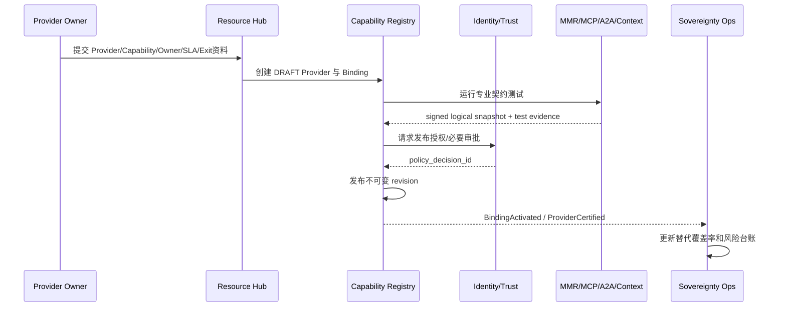
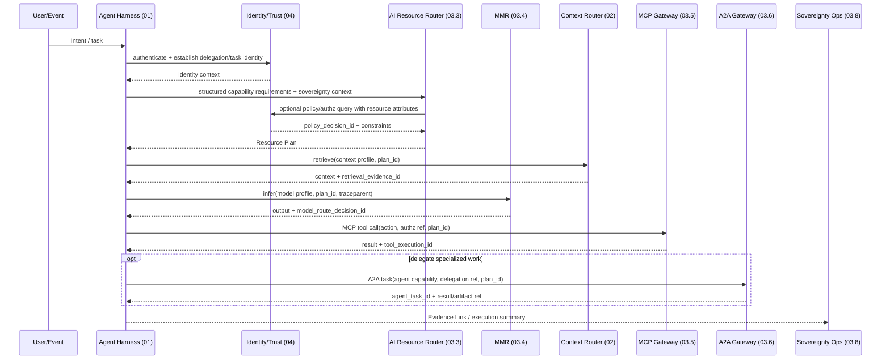
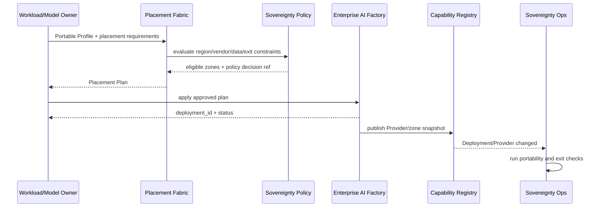

# 03 Sovereign AI & Open AI Fabric 模块交互与契约设计

## 1. 交互原则

1. 控制面只交换元数据、约束、计划和证据引用；业务载荷进入对应专业数据面。
2. 每个对象只有一个权威 Owner；跨模块使用 Snapshot/Reference，不复制可变内部状态。
3. 同步调用用于当前决策，CloudEvents 用于变更通知和缓存失效。
4. 身份从入口贯穿，授权由 04 工程裁决，数据面服务强制执行。
5. 所有调用传递 `trace_id`；业务链以 `task_id/resource_plan_id` 关联专业子 ID。
6. Provider 故障不允许绕过 Gateway、IAM 或主权政策直接访问底层实例。

## 2. 模块接口总表

| Provider | Consumer | 同步接口 | 事件 | 数据所有权 |
|---|---|---|---|---|
| Policy Plane | Registry/ARR/Gateways/Placement | `EvaluateSovereigntyConstraints` | `PolicySetActivated` | Policy Set、Zone、Vendor Rule |
| Capability Registry | Hub/ARR/Harness/Ops | capability/provider/binding query | `CapabilityPublished`、`BindingActivated` | 跨域能力语义与绑定 |
| ARR | Agent Harness | `ResolveResourcePlan` | `ResourcePlanResolved/Failed` | Plan 和跨域决策记录 |
| MMR | ARR/Harness/Ops | profile snapshot、inference | `ModelProfileChanged` | 模型 profile 与路由决定 |
| MCP Fabric | ARR/Harness/Ops | tool snapshot、MCP protocol | `ToolContractChanged` | MCP Server/Tool 协议状态和执行证据 |
| A2A Fabric | ARR/Harness/Ops | agent snapshot、A2A protocol | `AgentCardChanged` | Agent Card、A2A task evidence |
| Placement Fabric | ARR/AI Factory/Ops | zone query、resolve placement | `PlacementPlanCreated` | Portable Profile、Placement Plan |
| Identity/Trust（04） | 所有执行点 | authenticate/authorize/approve | `PolicyDecisionRecorded` | Identity、authorization decision |
| AI Factory | Placement/MMR/Ops | capacity/deploy/status | `DeploymentChanged` | 实际基础设施和 deployment |
| Context（02） | ARR/Harness/Ops | context snapshot、retrieve | `ContextCapabilityChanged` | Context 内容与检索证据 |

## 3. 对象契约

### 3.1 Capability Definition

```json
{
  "capability_id": "tool.erp.work-order.read",
  "major_version": 1,
  "resource_type": "TOOL_PROVIDER",
  "owner_ref": "group:manufacturing-integration",
  "risk_level": "LOW",
  "data_classification_max": "CONFIDENTIAL",
  "requirement_schema_ref": "schema://capabilities/tool.erp.work-order.read/v1",
  "lifecycle": {
    "state": "PUBLISHED",
    "deprecated_at": null,
    "sunset_at": null
  }
}
```

Capability 描述“企业需要什么”，不描述“某供应商怎么实现”。

### 3.2 Provider Snapshot

```json
{
  "provider_id": "enterprise-mcp-gateway",
  "provider_type": "TOOL_PROVIDER",
  "snapshot_version": "2027-01-15-42",
  "contract_version": "1.0",
  "valid_until": "2027-01-15T01:00:00Z",
  "capabilities": [
    {
      "capability_id": "tool.erp.work-order.read",
      "profile_or_action": "erp.work-order.read.v2",
      "regions": ["cn-east"],
      "risk_level": "LOW",
      "status": "AVAILABLE"
    }
  ],
  "digest": "sha256:..."
}
```

Snapshot 不包含凭证、业务载荷和底层实例清单。

### 3.3 Sovereignty Context

```json
{
  "tenant_ref": "tenant-a",
  "identity_ref": "workload:agent-harness",
  "task_ref": "task-...",
  "data_classification": "CONFIDENTIAL",
  "allowed_regions": ["cn-east"],
  "disallowed_vendor_refs": [],
  "required_deployment_zones": ["PRIVATE", "EDGE"],
  "exportability_required": true,
  "policy_set_revision": 17
}
```

这是主权约束输入，不是授权凭证。

### 3.4 Resource Plan

Resource Plan 沿用 ARR 契约，每个 item 指向一个专业 Provider：

```json
{
  "resource_plan_id": "rp-...",
  "policy_set_revision": 17,
  "items": [
    {
      "requirement_id": "model-1",
      "provider_id": "multi-model-router",
      "provider_type": "MODEL_PROVIDER",
      "profile_or_action": "reasoning-high-v2",
      "contract_version": "2027-01"
    },
    {
      "requirement_id": "tool-1",
      "provider_id": "enterprise-mcp-gateway",
      "provider_type": "TOOL_PROVIDER",
      "profile_or_action": "erp.work-order.read.v2",
      "contract_version": "1.0"
    }
  ],
  "expires_at": "2027-01-15T00:05:00Z"
}
```

ARR 不把多项 item 排成工作流；调用顺序由 Agent Harness 的 Plan 决定。

### 3.5 Evidence Link

```json
{
  "resource_plan_id": "rp-...",
  "trace_id": "...",
  "policy_decision_id": "pd-...",
  "model_route_decision_id": "mrd-...",
  "tool_execution_ids": ["te-..."],
  "agent_task_ids": ["a2a-task-..."],
  "retrieval_evidence_ids": ["re-..."],
  "placement_plan_id": "pp-...",
  "deployment_id": "dep-..."
}
```

Evidence Link 只关联 ID 和最小状态，不复制各域详情。

## 4. Provider 上线流程



准入必须包括：Owner、SLA、数据分类、区域、协议版本、兼容测试、SBOM/供应链要求、导出/退出说明和替代 Provider 策略。

## 5. Agent 运行主流程



关键约束：

- Harness 必须先规划，ARR 不解析自然语言或决定调用顺序。
- Context、模型、Tool、Agent 载荷分别走专业数据面。
- Tool/A2A 每次执行都在数据面重新检查授权和 Provider 状态，不能仅信任旧 Plan。
- `resource_plan_id` 是关联键，不是授权令牌。

## 6. AI Resource Router 与兄弟模块交互

### 6.1 ARR ↔ Capability Registry

| 方向 | 内容 | 一致性 |
|---|---|---|
| Registry → ARR | 发布 Capability/Provider/Binding/Snapshot revision | 事件失效 + TTL；ARR 读已发布快照 |
| ARR → Registry | 无运行写入；只读解析 | 防止运行流量修改目录 |
| ARR → Decision Ledger | plan、revision set、reason codes | 同事务或可靠异步 |

### 6.2 ARR ↔ MMR

- MMR 发布 logical profile Snapshot；ARR 不读取模型目录。
- ARR 返回 `provider=MMR + profile`；Harness 直接调用 MMR。
- MMR 返回 `model_route_decision_id`；ARR 不复制模型路由细节。
- MMR 内部切换模型不触发 ARR Binding 变化。

### 6.3 ARR ↔ MCP Fabric

- MCP Fabric 发布 logical action Snapshot，包括 risk、idempotency、approval requirement。
- ARR 返回 MCP Gateway endpoint_ref 和 action。
- Harness/MCP Client 调 Gateway；Gateway 使用 04 工程的授权决定并执行。
- Tool Server 迁移只更新 MCP Fabric；action contract 稳定时 ARR 和 Agent 不变化。

### 6.4 ARR ↔ A2A Fabric

- A2A Fabric 将 Agent Card 投影为 logical agent capability Snapshot。
- ARR 只在启用 `AGENT_PROVIDER` 后解析到 A2A Gateway/Agent capability。
- A2A Gateway 负责发现具体 Agent endpoint、协议会话和任务状态。
- Agent 的内部模型、Prompt、Memory、Tools 不进入 ARR。

### 6.5 ARR ↔ Placement Fabric

有两种模式：

1. **运行时已部署资源**：ARR 只选择已存在 Provider，不调用 Placement。
2. **需要新部署/迁移**：控制面异步创建 Placement Plan；AI Factory 完成部署并发布 Provider Snapshot 后，ARR 才能用于新请求。

ARR 不在用户请求同步路径创建 GPU、部署模型或迁移服务。

### 6.6 ARR ↔ Policy Plane / Identity Trust

- Policy Plane 提供主权约束模板和 policy revision。
- 04 工程的 PDP 基于身份、任务、资源、风险和主权规则产生决定。
- ARR 可用决定中的 constraints 过滤 Provider，但数据面仍必须执行授权。
- PDP 不可用时，高风险和管理操作 fail closed；低风险解析是否使用短期缓存决定由 04 工程政策明确。

## 7. MCP 交互设计

### 7.1 目录分层

```text
Capability Registry
  企业语义：tool.erp.work-order.read
        ↓ Binding
MCP Registry
  协议对象：server/action/version/transport
        ↓ Runtime discovery
MCP Gateway
  authn/authz/risk enforcement/session/proxy/evidence
        ↓
Domain MCP Server
  business adapter / transaction
```

### 7.2 安全调用

1. Harness 使用 Agent/Task identity 连接 MCP Gateway。
2. Gateway 解析 action contract，向 04 PDP 查询或验证短期授权决定。
3. Gateway 应用参数 Schema、风险级别、幂等、审批和速率限制。
4. 对写操作优先 `preview → approve → execute`；Tool Server 负责业务事务。
5. Gateway 返回 execution ID、状态和最小结果；敏感结果按数据策略直接返回 Harness，不进入 ARR/Registry。

## 8. A2A 交互设计

### 8.1 目录分层

```text
Capability Registry
  企业语义：agent.supply-risk.analyze
        ↓ Binding
Agent Registry / A2A Card
  skills/interface/version/endpoint_ref
        ↓
A2A Gateway
  trust-domain mapping/delegation/protocol/evidence
        ↓
Remote Agent Runtime (01 or external)
```

### 8.2 委派约束

- Delegation token/credential 由 04 工程签发，不由 A2A Gateway 自造身份。
- 子 Agent 权限不得超过任务委派范围，禁止简单透传父 Agent 全部权限。
- 长任务必须支持 status/cancel 和超时；artifact 使用引用和完整性 digest。
- 跨组织 A2A 必须经过外部信任域、数据出境和供应商政策检查。
- A2A Gateway 只处理协议和边界控制，不接管内部 Agent 编排。

## 9. Placement 与迁移流程



`PortableDeploymentProfile` 至少包含 artifact digest、architecture、accelerator class、runtime contract、configuration schema、secret references、data dependencies、health/SLO、export procedure 和 license/SBOM。

## 10. 供应商退出流程

1. Ops 识别供应商风险或触发年度演练。
2. Registry 列出受影响 Capability、Binding、Agent 和环境。
3. 检查替代 Provider 与协议兼容等级。
4. 导出配置、制品、必要数据和证据，验证 digest 与可读性。
5. 在预生产对替代 Provider 运行 contract/eval/security tests。
6. 发布新 Binding 或 Placement Plan，灰度迁移。
7. 对比 SLO、成本、结果质量和数据边界。
8. 冻结旧 Provider 新流量，完成撤权、凭证吊销和数据删除证明。

退出演练必须验证“能真正迁移”，不能只检查合同中存在导出条款。

## 11. 事件目录

| 事件 | Producer | Consumer | 作用 |
|---|---|---|---|
| `SovereigntyPolicySetActivated.v1` | Policy Plane | ARR/Gateways/Placement/Ops | 刷新约束 |
| `CapabilityPublished.v1` | Registry | Hub/ARR/Harness | 新能力可发现 |
| `CapabilityBindingActivated.v1` | Registry | ARR/Ops | 缓存失效与风险更新 |
| `ProviderSnapshotChanged.v1` | Domain Fabric | Registry/ARR/Ops | 专业能力摘要变化 |
| `ProviderSuspended.v1` | Registry/Domain | ARR/Harness/Gateways/Ops | 停止新解析/执行 |
| `ResourcePlanResolved.v1` | ARR | Ops/Audit | 跨域决策证据 |
| `ModelRouteDecided.v1` | MMR | Ops/FinOps/Eval | 模型子决定 |
| `ToolExecutionCompleted.v1` | MCP Gateway | Harness/Ops/Audit | Tool 证据 |
| `AgentTaskChanged.v1` | A2A Gateway | Harness/Ops | 委派状态 |
| `PlacementPlanCreated.v1` | Placement | Factory/Ops | 放置决定 |
| `DeploymentChanged.v1` | AI Factory | Registry/Ops | 实际资源状态 |
| `ExitDrillCompleted.v1` | Ops | Governance/Risk | 退出能力证据 |

事件采用 CloudEvents，至少一次投递，消费者按 event ID 幂等。业务敏感数据只以受控引用出现。

## 12. 错误归属

| 错误 | 定义方 | 处理方 |
|---|---|---|
| `NO_COMPATIBLE_PROVIDER` / `AMBIGUOUS_BINDING` | ARR | Harness/平台治理 |
| 模型不可用、配额、成本、回退失败 | MMR | Harness/MMR SRE |
| MCP transport、tool schema、execution | MCP Fabric/Tool Server | Harness/领域 Owner |
| A2A task、agent unreachable、artifact | A2A Fabric/Agent Runtime | Harness/Agent Owner |
| unauthorized/approval required/risk denied | 04 Identity Trust | 对应数据面强制执行 |
| no eligible zone/capacity unavailable | Placement/AI Factory | 控制面/基础设施 |
| Context freshness/source/access | 02 Context & Memory | Harness/Context Owner |

禁止 ARR 把所有下游错误包装成统一“资源失败”，否则会破坏可诊断性和权威边界。

## 13. 契约验收

- [ ] MMR 内部模型变化不触发 ARR/Agent 配置变更。
- [ ] MCP Server 迁移且 action contract 不变时，Capability ID 不变。
- [ ] A2A Agent 实现替换且 Agent Card contract 不变时，调用方不变。
- [ ] Resource Plan 可关联授权、模型、Tool、Agent、Context 和 Placement 证据。
- [ ] ARR/Registry 数据库中找不到 Prompt、Tool 参数、模型响应和凭证。
- [ ] Identity/Trust 不可用时所有高风险执行 fail closed。
- [ ] Placement 不能在 ARR 同步请求中临时创建基础设施。
- [ ] Provider suspend 在目标 SLO 内阻止新计划和新执行。
- [ ] 退出演练可在不修改 Agent 业务代码的情况下切换至少一个关键 Provider。
