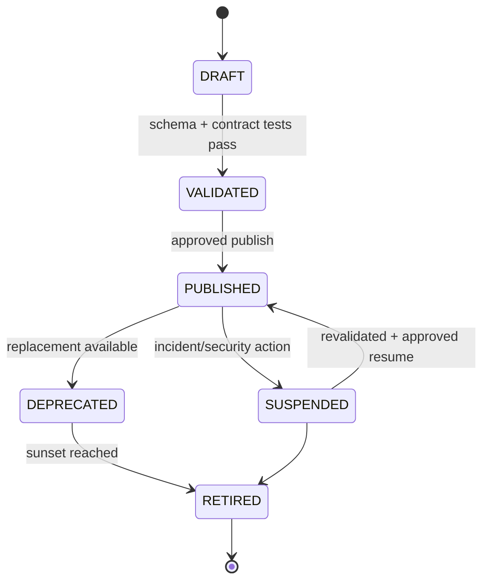

# AI Resource Resolver 数据与事件设计

## 1. Schema 与表结构

数据库 schema：`ai_resource_resolver`。以下是逻辑 DDL 基线，实际类型和命名跟随 MMR 的数据库规范。

| 表 | 主键 | 关键列 | 索引/约束 |
|---|---|---|---|
| `capability_definition` | `id` | `capability_key, major_version, revision, resource_type, requirement_schema, state` | unique `(capability_key, major_version, revision)`；index `(state, resource_type)` |
| `resource_provider` | `id` | `provider_key, provider_type, endpoint_ref, owner_ref, state, revision` | unique `(provider_key, revision)`；index `(provider_type,state)` |
| `provider_snapshot` | `id` | `provider_id, snapshot_version, contract_version, digest, profiles, generated_at, valid_until, state` | unique `(provider_id,snapshot_version)`；index `(provider_id,state,valid_until)` |
| `capability_binding` | `id` | `capability_id, provider_id, snapshot_id, profile_or_action, environment, scope_hash, constraints, priority, state, revision` | unique `(id,revision)`；发布时检查同 scope 冲突 |
| `resource_plan` | `id` | `tenant_ref_hash, task_ref_hash, request_digest, status, created_at, expires_at` | index `(created_at)`、`(request_digest,created_at)`；按月分区 |
| `resource_plan_item` | `id` | `plan_id, requirement_id, capability_id, binding_id, provider_descriptor, reason_codes` | unique `(plan_id,requirement_id)` |
| `decision_record` | `id` | `plan_id, trace_id, caller_ref_hash, decision_fingerprint, registry_revision_set, reason_codes` | unique `(plan_id)`；index `(trace_id)`；按月分区 |
| `idempotency_record` | `id` | `caller_ref_hash, endpoint, idem_key_hash, request_digest, response_ref, expires_at` | unique `(caller_ref_hash,endpoint,idem_key_hash)` |
| `change_record` | `id` | `aggregate_type, aggregate_id, before_digest, after_digest, actor_ref, reason, ticket_ref, approval_ref` | index `(aggregate_type,aggregate_id,created_at)` |
| `outbox_event` | `id` | `aggregate_type, aggregate_id, event_type, event_version, payload, created_at, published_at, attempts` | index partial `(created_at) where published_at is null` |

### 1.1 状态机



已发布 revision 不允许返回 DRAFT 或被原地修改。Rollback 是创建/激活一个指向历史内容的新发布 revision，不删除审计历史。

### 1.2 Scope 规范化

`scope` 以规范 JSON 存储并计算 `scope_hash`：

```json
{
  "tenant_refs": ["tenant-a"],
  "factory_refs": ["factory-01"],
  "regions": ["cn-east"],
  "agent_refs": []
}
```

数组排序、去重、Unicode 规范化后再计算 SHA-256。空数组表示不限定该维度，不能表示 deny；deny 由外部授权系统决定。

## 2. 数据不变量

1. 一个 Binding 的 `resource_type` 必须与 Capability 和 Provider 一致。
2. `profile_or_action` 必须存在于引用 Snapshot 且声明对应 capability。
3. Binding 有效期不得超过 Snapshot 可证明的契约兼容范围；Snapshot 的运行健康可滚动刷新。
4. 新 Plan 只使用 `PUBLISHED` Capability、Provider 和 Binding，以及未过期 Snapshot。
5. `SUSPENDED/RETIRED` Provider 不进入新 Plan。
6. Plan 创建后其 item 不可修改；状态只允许 `RESOLVED → EXPIRED/REVOKED`。
7. 决策记录必须包含所有被选中对象的 ID、revision 和 Snapshot digest。
8. 生产 Binding 必须有 `change_reason`、`ticket_ref` 和需要时的 `approval_ref`。
9. 禁止存储实际凭证、Prompt、上下文正文、工具参数、模型响应、模型供应商内部路由细节。

## 3. 事务边界

| 命令 | 单事务内容 |
|---|---|
| Publish Capability/Binding | 写新 revision、更新 active pointer、写 change_record、写 outbox_event |
| Ingest Snapshot | 验证版本、写 snapshot、更新 active snapshot pointer、写 outbox_event |
| Resolve | 读取发布快照、写 plan/items/decision/idempotency；可按容量将 Ledger 异步化，但 Plan 与幂等记录必须一致 |
| Suspend Provider | 更新状态、写 change_record、写 outbox_event；不批量改历史 Plan |

隔离级别默认 `READ COMMITTED`；发布命令通过聚合 revision 的 compare-and-swap 防止丢失更新。冲突热点经压测后才考虑 `SERIALIZABLE` 或 advisory lock。

## 4. 缓存模型

一期使用应用内缓存：

- Key：`environment + tenant/factory scope digest + capability key/major`；
- Value：已发布候选 Binding 的不可变快照；
- TTL：30–60 秒，带随机抖动；
- 最大条目与内存上限必须配置；
- `BindingActivated/ProviderSuspended/SnapshotChanged` 触发本实例失效；
- 事件不可用时依靠 TTL 收敛；
- Cache miss 只允许单航班加载，防止击穿；
- 不缓存授权决定和业务载荷。

只有在压测证明本地缓存导致数据库负载或跨实例生效时间不达标时，才评估 Redis。

## 5. 事件规范

### 5.1 CloudEvents 信封

事件使用 CloudEvents 1.0.x JSON 格式：

```json
{
  "specversion": "1.0",
  "id": "0199...",
  "source": "urn:enterprise:ai-resource-resolver",
  "type": "com.enterprise.ai.resource.binding.activated.v1",
  "subject": "binding/0199...",
  "time": "2026-09-21T02:00:00Z",
  "datacontenttype": "application/json",
  "dataschema": "https://schemas.example.internal/ai-resource/binding-activated-v1.json",
  "traceparent": "00-...",
  "tenantref": "tenant-a",
  "data": {}
}
```

CloudEvents context attributes 不放敏感信息；`tenantref` 如属敏感标识，改用不可逆别名。事件 payload 必须最小化，不携带完整 Snapshot profiles，消费者按受控 API 拉取。

### 5.2 事件目录

| type | 触发点 | 最小 payload | 主要消费者 |
|---|---|---|---|
| `...capability.published.v1` | Capability 发布 | key、major、revision、state | Portal、审计 |
| `...capability.deprecated.v1` | 设置退役 | key、major、sunset_at | Agent治理、Portal |
| `...provider.snapshot-changed.v1` | 激活 Snapshot | provider_id、snapshot_version、digest、valid_until | ARR instances、审计 |
| `...binding.activated.v1` | Binding 发布/回滚 | binding_id、capability_ref、provider_ref、revision、environment、scope_hash | Cache、Portal、审计 |
| `...provider.suspended.v1` | 紧急暂停 | provider_id、reason_code、effective_at | Harness、各网关、告警 |
| `...resource-plan.resolved.v1` | Plan 生成 | plan_id、resource_type_count、decision_fingerprint、expires_at | 审计/成本关联；默认采样策略待定 |
| `...resource-plan.failed.v1` | 解析失败 | request_digest、error_code、capability_refs | SRE、治理 |

### 5.3 BindingActivated 示例

```json
{
  "binding_id": "0199...",
  "capability_ref": {
    "key": "model.reasoning.high",
    "major_version": 1,
    "revision": 12
  },
  "provider_ref": {
    "key": "multi-model-router",
    "snapshot_digest": "sha256:..."
  },
  "binding_revision": 7,
  "environment": "prod",
  "scope_hash": "sha256:...",
  "effective_at": "2026-09-21T03:00:00Z"
}
```

### 5.4 交付语义

- Outbox Worker 以 `FOR UPDATE SKIP LOCKED` 批量领取待发事件；
- 投递为 at-least-once；消费者以 CloudEvent `id` 去重；
- 最大重试次数后进入 dead-letter 状态并告警，不删除原记录；
- 同一 aggregate 使用 `revision` 检测乱序；旧 revision 可确认并忽略；
- 事件总线不可用不阻塞管理事务，但 outbox lag 超阈值禁止大批量发布；
- ResourcePlanResolved 事件量大时可采样，Decision Ledger 不采样。

## 6. 保留、归档和删除

| 数据 | 默认保留 | 删除方式 | 说明 |
|---|---:|---|---|
| Capability/Provider/Binding revision | 在用全周期 + 2 年 | 到期审批后清理 | 元数据和摘要进入 Evidence Pack |
| Provider Snapshot | 90 天在线 | 分区清理 | 被审计 Plan 引用的 digest 保留 1 年 |
| Resource Plan/Item | 90 天在线 | 按月分区删除 | 不含调用正文；证据摘要保留 1 年 |
| Decision Record | 1 年 | 月分区到期清理 | 每日摘要写 WORM Evidence Pack |
| Idempotency Record | 48 小时 | TTL worker | key 只保存 hash |
| Change Record | 2 年 | 到期审批后清理 | 高风险变更支持 legal hold |
| Outbox Event | 发布后 14 天 | 分区清理 | DLQ 闭环后再清理；NATS 留存 7 天 |

删除任务必须有速率限制、审计和 dry-run。任何法务留置要求由外部合规系统下发，ARR 只按已批准策略执行。

## 7. 备份与恢复

- PostgreSQL 18.6 由 CloudNativePG 1.30.0 管理，单地域三个实例跨三个故障域；MVP 采用异步流复制，自动 failover。
- 开启 WAL 连续归档和 PITR；RPO 设计值不超过 5 分钟，RTO 不超过 60 分钟。
- 每日自动 base backup，保留 35 天；WAL 保留覆盖最近 35 天。至少一份备份位于同一主权地域内的独立故障域并使用独立凭据。
- 每月恢复到隔离环境，验证 schema、行数、关键 revision、checksum 和 API smoke test；连续三次达标后可改为每季度。
- 恢复后先以只读模式启动，核对 active pointers 和 outbox 水位，再开放管理写。
- Provider Snapshot 可由专业系统重新发布，但 Capability/Binding/Decision 不得只依赖重建。

## 8. 数据验收

- [ ] 所有外键、唯一约束和状态转换均有数据库或领域层强制约束。
- [ ] 并发 publish 不产生两个 active revision。
- [ ] Outbox 注入故障时业务写与事件不会出现半提交。
- [ ] 事件重复、乱序、延迟 24 小时的消费者测试通过。
- [ ] 分区创建和清理可在不中断 Resolve 的情况下完成。
- [ ] 备份恢复演练达到 RTO/RPO。
- [ ] 数据扫描确认 Prohibited 字段没有落库或进入事件。
